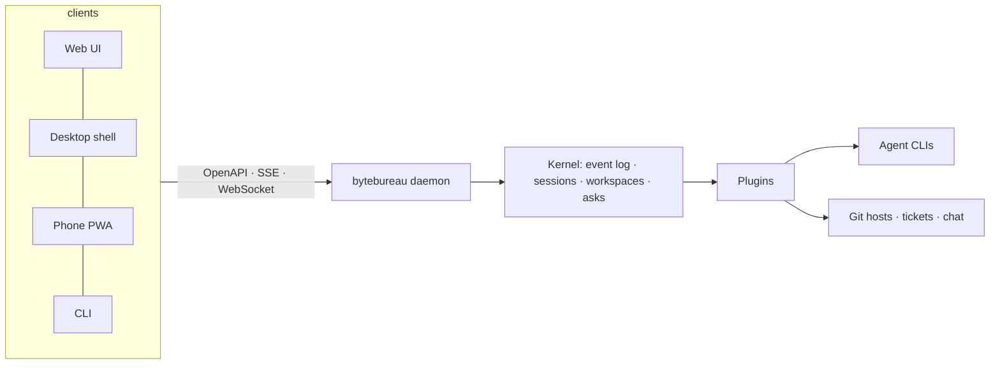

<div align="center">
  <picture>
    <source media="(prefers-color-scheme: dark)" srcset="assets/readme/wordmark-dark.svg">
    
  </picture>

  <p><strong>Vaše AI kancelář: kancelář kódovacích agentů v izolovaných pracovních prostorech, řízená z jednoho pixel-art patra i z telefonu.</strong></p>

  <p>
    <a href="https://github.com/misaon/byte-bureau/releases"></a>
    <a href="https://github.com/misaon/byte-bureau/actions/workflows/ci.yml"></a>
    <a href="https://scorecard.dev/viewer/?uri=github.com/misaon/byte-bureau"></a>
    <a href="LICENSE.md"></a>
    <a href="https://github.com/misaon/byte-bureau/discussions"></a>
  </p>

  <p>Čeština · <a href="README.md">English</a></p>
</div>

## Co je ByteBureau?

**Problém.** Provozovat kódovací agenty ve velkém znamená žonglovat s terminály, worktrees, diskusemi v code review a tickety, a přitom nemít skutečný přehled o tom, co který agent právě dělá. Nástroje jednotlivých výrobců navíc podporují jen GitHub nebo jen jeden model.

**Metafora.** ByteBureau je kancelář. Každý agent je zaměstnanec se svým stolem, každý projekt je patro a každá relace běží ve vlastním izolovaném pracovním prostoru (dnes git worktree, příště zabezpečený kontejner). Když zaměstnanec předá práci kolegovi, uvidíte, jak obálka putuje. Když zaměstnanec čeká na vaše rozhodnutí, dostanete dialog s doporučenou odpovědí, na počítači i v telefonu.

**Slib.** Pozorovatelný, auditovatelný, rozšiřitelný. Jakýkoli agent spouštěný z příkazové řádky (Claude Code, Codex, OpenCode, jakýkoli agent s podporou Agent Client Protocol), jakýkoli git hosting, jakýkoli systém pro tickety, jakýkoli chat, vše přes pluginy. Vaše předplatná, váš počítač, vaše data.

## Stav

Fáze pre-alfa. Základ (nástroje, CI, pipeline pro vydávání verzí, licence) a jádro kanceláře (fáze A: relace v izolovaných git worktrees, trvalý záznam událostí, otázky s doporučenou volbou, hostitel pro pluginy) jsou hotové. Hotová je i fáze B: `bytebureau serve` spouští daemon s HTTP API, SSE a RPC; CLI s ním komunikuje (nebo s přepínačem `--no-daemon` spustí jádro přímo ve svém procesu). Testovací zaměstnanec už přijme zadání příkazem `bytebureau run --provider fake`, odpracuje ho ve vlastním worktree a odevzdá výsledek bez grafického rozhraní, aniž byste potřebovali předplatné agenta. Skuteční zaměstnanci, uživatelské rozhraní chatu a simulace kanceláře následují. Postup podle dílčích projektů:

- [x] 0 · Základ
- [ ] 1 · Jádro a běhové prostředí agentů (jádro, daemon a API jsou hotové; adaptéry agentů následují)
- [ ] 2 · UI pro chat a dashboard
- [ ] 3 · Simulace kanceláře
- [ ] 4 · Workflow engine a integrace (Jira, GitHub, Slack)
- [ ] 5 · Izolace v kontejnerech (Docker, Docker Sandboxes, Kubernetes)
- [ ] 6 · Aplikace pro počítač a instalátory
- [ ] 7 · Ovládání z telefonu s end-to-end šifrováním
- [ ] 8 · Telemetrie a sebezdokonalování
- [ ] 9 · Editor rozvržení a další pluginy

Specifikace najdete v [`docs/superpowers/specs`](docs/superpowers/specs) a rozhodnutí v [`docs/decisions`](docs/decisions).

## Rychlý start

Stáhněte si binární soubor pro svou platformu z [nejnovějšího vydání](https://github.com/misaon/byte-bureau/releases/latest) a poté spusťte:

```bash
chmod +x bytebureau-*
./bytebureau-* --version
./bytebureau-* hello --lang cs
```

Ověřte, co jste stáhli:

```bash
gh attestation verify bytebureau-* --owner misaon
```

Instalátory (`npx`, Homebrew, Scoop, winget, `curl | sh`) přibudou s dílčím projektem 6.

## Funkce

- 🏢 **Pravdivá simulace kanceláře** · každá póza postavy odráží skutečnou událost agenta; nikdy „pracuje“, když je agent nečinný *(plánováno, dílčí projekt 3)*
- 🐳 **Izolované pracovní prostory** · nyní jeden worktree na relaci, příště zabezpečené kontejnery přenositelné na Kubernetes a Raspberry Pi *(dílčí projekty 1 a 5)*
- 🔌 **Pluginy pro všechno** · poskytovatelé agentů, běhová prostředí pracovních prostorů, git hosting, systémy pro tickety, chat, oznámení *(dílčí projekt 1)*
- 🤖 **Váš vlastní agent** · Claude Code, Codex, OpenCode, Gemini CLI, Pi a libovolný agent s podporou ACP, s vlastními předplatnými nebo API klíči *(dílčí projekt 1)*
- 💬 **Chat, který lze sledovat** · živé přepisy, ukazatel kontextu, dialogy s otázkou a doporučenou volbou *(dílčí projekt 2)*
- 📱 **Ovládání z telefonu s end-to-end šifrováním** · slepý relay, který nemůže číst vaše přepisy *(dílčí projekt 7)*
- 📊 **Telemetrie, která patří vám** · lokálně uložené trajektorie, které lze exportovat pro analýzu a vylepšování promptů *(dílčí projekt 8)*
- 🌍 **Čeština a angličtina** · už od prvního binárního souboru

## Jak to funguje



## Bezpečnost a soukromí

ByteBureau běží na vašem počítači, ve výchozím nastavení naslouchá jen na adrese localhost, nikdy neukládá přihlašovací údaje vašich agentů a dodává podepsaná vydání s atestací původu a se SBOM. Jak hlásit zranitelnosti a co spadá do rozsahu, najdete v [SECURITY.md](SECURITY.md).

## Přispívání

Přečtěte si [CONTRIBUTING.md](CONTRIBUTING.md): `mise install`, `bun install`, `bun run check`. Vyžadujeme Conventional Commits a podpis DCO (sign-off). Úkoly vhodné pro první příspěvek mají štítek `good first issue`.

## Komunita

Dotazy a nápady patří do [Diskusí](https://github.com/misaon/byte-bureau/discussions). Bezpečnostní problémy hlaste přes [soukromé hlášení zranitelností](https://github.com/misaon/byte-bureau/security/advisories/new).

## Historie hvězdiček

<a href="https://star-history.com/#misaon/byte-bureau&Date">
  <picture>
    <source media="(prefers-color-scheme: dark)" srcset="https://api.star-history.com/svg?repos=misaon/byte-bureau&type=Date&theme=dark">
    
  </picture>
</a>

## Licence

ByteBureau je Fair Source pod licencí Functional Source License (FSL-1.1-MIT): můžete ho zdarma používat, číst, upravovat a přispívat; jediným omezením je nabízet ho jako konkurenční komerční produkt. Každé vydání se dva roky po zveřejnění stává MIT. SDK balíčky jsou MIT. Viz [LICENSE.md](LICENSE.md) a [TRADEMARK.md](TRADEMARK.md).

Vytvořeno s ❤️ v Česku.
