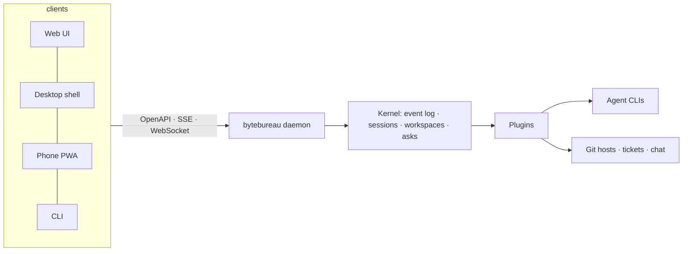

<div align="center">
  <picture>
    <source media="(prefers-color-scheme: dark)" srcset="assets/readme/wordmark-dark.svg">
    
  </picture>

  <p><strong>Your AI office: a bureau of coding agents in isolated workspaces, orchestrated from one pixel-art floor and from your phone.</strong></p>

  <p>
    <a href="https://github.com/misaon/byte-bureau/releases"></a>
    <a href="https://github.com/misaon/byte-bureau/actions/workflows/ci.yml"></a>
    <a href="https://scorecard.dev/viewer/?uri=github.com/misaon/byte-bureau"></a>
    <a href="LICENSE.md"></a>
    <a href="https://github.com/misaon/byte-bureau/discussions"></a>
  </p>

  <p>English · <a href="README.cs.md">Čeština</a></p>
</div>

## What is ByteBureau?

**The problem.** Running coding agents at scale means juggling terminals, worktrees, review threads and tickets, with no honest picture of what each agent is doing right now, and with vendor tools that only speak GitHub or only speak one model.

**The metaphor.** ByteBureau is an office. Each agent is an employee with a desk; each project is a floor; every session runs in its own isolated workspace (a git worktree today, a hardened container next). When an employee hands work to a colleague you see the envelope travel. When an employee waits for your decision you get a dialog with a recommended answer, on your desktop or your phone.

**The promise.** Observable, auditable, extensible. Any agent CLI (Claude Code, Codex, OpenCode, any Agent Client Protocol agent), any git host, any ticket system, any chat, through plugins. Your subscriptions, your machine, your data.

## Status

Pre-alpha. The foundation (toolchain, CI, release pipeline, licence) is in place; the kernel, chat UI and office simulation follow. Progress by sub-project:

- [x] 0 · Foundation
- [ ] 1 · Kernel and agent runtime
- [ ] 2 · Chat and dashboard UI
- [ ] 3 · Office simulation
- [ ] 4 · Workflow engine and integrations (Jira, GitHub, Slack)
- [ ] 5 · Container isolation (Docker, Docker Sandboxes, Kubernetes)
- [ ] 6 · Desktop app and installers
- [ ] 7 · End-to-end encrypted phone remote
- [ ] 8 · Telemetry and self-improvement
- [ ] 9 · Layout editor and more plugins

Specs live in [`docs/superpowers/specs`](docs/superpowers/specs) and decisions in [`docs/decisions`](docs/decisions).

## Quick start

Download the binary for your platform from the [latest release](https://github.com/misaon/byte-bureau/releases/latest), then:

```bash
chmod +x bytebureau-*
./bytebureau-* --version
./bytebureau-* hello --lang cs
```

Verify what you downloaded:

```bash
gh attestation verify bytebureau-* --owner misaon
```

Installers (`npx`, Homebrew, Scoop, winget, `curl | sh`) arrive with sub-project 6.

## Features

- 🏢 **Truthful office simulation** · every posture mirrors a real agent event; never "working" when idle *(planned, sub-project 3)*
- 🐳 **Isolated workspaces** · a worktree per session now, hardened containers portable to Kubernetes and Raspberry Pi next *(sub-projects 1 and 5)*
- 🔌 **Plugins for everything** · agent providers, workspace runtimes, git hosts, ticket systems, chat, notifiers *(sub-project 1)*
- 🤖 **Bring your own agent** · Claude Code, Codex, OpenCode, Gemini CLI, Pi and any ACP agent, with your own subscriptions or API keys *(sub-project 1)*
- 💬 **A chat you can follow** · live transcripts, context meter, asking dialogs with a recommended option *(sub-project 2)*
- 📱 **Phone remote with end-to-end encryption** · a blind relay that cannot read your transcripts *(sub-project 7)*
- 📊 **Telemetry you own** · local trajectories, exportable for analysis and prompt improvement *(sub-project 8)*
- 🌍 **Czech and English** · from the first binary

## How it works



## Security and privacy

ByteBureau runs on your machine, binds to localhost by default, never stores your agent credentials, and ships signed, attested releases with an SBOM. See [SECURITY.md](SECURITY.md) for reporting and scope.

## Contributing

Read [CONTRIBUTING.md](CONTRIBUTING.md): `mise install`, `bun install`, `bun run check`. Conventional Commits and a DCO sign-off are required. Good first issues are labelled `good first issue`.

## Community

Questions and ideas belong in [Discussions](https://github.com/misaon/byte-bureau/discussions). Security issues go through [private vulnerability reporting](https://github.com/misaon/byte-bureau/security/advisories/new).

## Star history

<a href="https://star-history.com/#misaon/byte-bureau&Date">
  <picture>
    <source media="(prefers-color-scheme: dark)" srcset="https://api.star-history.com/svg?repos=misaon/byte-bureau&type=Date&theme=dark">
    
  </picture>
</a>

## Licence

ByteBureau is Fair Source under the Functional Source License (FSL-1.1-MIT): free to use, read, modify and contribute; the only restriction is offering it as a competing commercial product. Each release becomes MIT two years after publication. SDK packages are MIT. See [LICENSE.md](LICENSE.md) and [TRADEMARK.md](TRADEMARK.md).

Made with ❤️ in Czechia.
