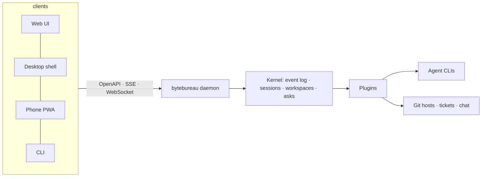

# Foundation (Sub-project 0) Implementation Plan

> **For agentic workers:** REQUIRED SUB-SKILL: Use superpowers:subagent-driven-development (recommended) or superpowers:executing-plans to implement this plan task-by-task. Steps use checkbox (`- [ ]`) syntax for tracking.

**Goal:** Build the ByteBureau monorepo foundation — toolchain, quality gates, CI/CD, release pipeline, licence and community files, docs and i18n scaffolds — proven end to end by a localised `bytebureau` binary for eight targets.

**Architecture:** Bun workspaces + Turborepo monorepo with a strict TypeScript 7 configuration, oxlint/oxfmt as the primary lint/format stack (ESLint long tail isolated in `tools/eslint-long-tail`), repo-wide gates (knip, dependency-cruiser, cspell, markdownlint, ls-lint), GitHub Actions workflows with SHA-pinned actions, and a tag-triggered release that cross-compiles eight binaries, attests them, signs them and publishes an immutable release. The only product code is `apps/bytebureau` (citty CLI) using `packages/i18n` (Paraglide JS 2).

**Tech Stack:** Bun 1.4.x, Node 26 (dev only), TypeScript 7.0.x (+ `@typescript/typescript6` inside the ESLint tool dir), oxlint + oxlint-tsgolint, oxfmt, Turborepo 2.x, Vitest 5, fast-check, lefthook 2, commitlint 21, changelogen, Renovate, Paraglide JS 2, citty, @clack/prompts, picocolors, Astro Starlight, GitHub Actions (checkout v7, setup-node v7, setup-bun v2, cache v6, harden-runner v2, attest-build-provenance v4, attest v4, cosign-installer v4, sbom-action v0, `gh release`, labeler v7, stale v11, scorecard v2, zizmor-action).

**Spec:** `docs/superpowers/specs/2026-10-02-foundation-design.md`

## Global Constraints

- Runtime: Bun pinned in `.bun-version` (`1.4.2`) and `mise.toml`; `engines.bun >= 1.4.0`; Node 26 is dev-only (Vitest, ESLint long tail, Astro) and never required at runtime.
- TypeScript: `typescript` 7.0.x at the root; `@tsconfig/strictest` base plus `exactOptionalPropertyTypes`, `noUncheckedIndexedAccess`, `noPropertyAccessFromIndexSignature`, `noImplicitOverride`, `noUncheckedSideEffectImports`, `verbatimModuleSyntax`, `erasableSyntaxOnly`, `isolatedDeclarations` (libraries), `module`/`moduleResolution` = `nodenext`, explicit `types`.
- Lint: oxlint with every category (`correctness`, `suspicious`, `pedantic`, `perf`, `restriction`, `style`) at `error`, type-aware mode on; oxfmt `--check` is a CI gate; ESLint long tail runs in CI only.
- Commits: Conventional Commits validated by commitlint with `type-enum` = `feat fix perf refactor docs test build ci chore revert` and `scope-enum` = workspace directory names + `cli`, `deps`, `release`, `repo`, `ci`, `docs`; PR titles validated with the same types and scopes; squash-only merges; subject starts lowercase (config-conventional's default `subject-case`, proper nouns inside the subject allowed).
- Licence strings: root and app packages `"license": "FSL-1.1-MIT"`; the project is described as "fair source" / "source-available", never as "open source".
- Package naming: workspace packages are `@bytebureau/<name>`; `apps/bytebureau` is the `bytebureau` binary package (private).
- Dependency rules (dependency-cruiser): only `packages/kernel`, `packages/api`, `packages/protocol` may import `effect`; `plugins/*` may import only `@bytebureau/plugin-api`, `@bytebureau/protocol` and third-party packages; nothing imports from `apps/*`; no circular dependencies.
- Binary targets (exactly eight): `bun-darwin-arm64`, `bun-darwin-x64`, `bun-linux-x64`, `bun-linux-arm64`, `bun-linux-x64-musl`, `bun-linux-arm64-musl`, `bun-windows-x64`, `bun-windows-arm64`; artifact names `bytebureau-<version>-<os>-<arch>[-musl][.exe]`.
- CI targets: PR pipeline ≤ 6 minutes, release ≤ 20 minutes; every `uses:` pinned to a commit SHA; `permissions: contents: read` at workflow top level; `persist-credentials: false` on checkout; harden-runner first step.
- README ≤ 300 lines, markdownlint clean; `README.cs.md` mirrors section structure.
- Coverage thresholds 80 % lines/branches on `packages/*` (apps excluded until SP1).

**Deviations from the spec (recorded so reviewers see them):** (1) repo-wide tools (oxlint, oxfmt, knip, dependency-cruiser, cspell, markdownlint, ls-lint, Vitest) run as root scripts instead of per-package Turborepo tasks — same gates, faster; Turborepo runs `build`, `typecheck`, `docs:build`. (2) Versioning uses `changelogen --release --push --no-github` alone (it bumps the root version, writes the changelog, commits and tags; the workflow creates the GitHub release); `bumpp` is not added because it would bump twice. (3) Turbo remote cache uses the documented `TURBO_TOKEN`/`TURBO_TEAM` variables when the owner adds them; until then the local cache is used (OIDC linking is an owner action). (4) `release.yml` has no Homebrew job: homebrew-releaser requires `{repo}-{version}-{os}-{amd64|arm64}.tar.gz` archives, which raw binaries cannot satisfy; installers arrive with sub-project 6. (5) The admin repository role bypasses the main ruleset so the owner's release commit and tag can be pushed to `main` directly. (6) The dependency catalog is deferred until Renovate reads Bun's `workspaces.catalog`; versions stay in the manifests.

## Review Focus

1. `--lang` with an unsupported value (`--lang de`) must fall back to English and print a one-line warning on stderr, never crash — test added to Task 6.
2. `LANG`/`LC_ALL` values such as `C.UTF-8`, `POSIX`, `cs_CZ.UTF-8`, empty string must resolve deterministically (`cs_CZ.UTF-8` → `cs`, everything unknown → `en`) — tests in Task 6 (`resolveLocale`).
3. `--json` output must never contain ANSI escape codes, even with `FORCE_COLOR=1` in the environment — test in Task 6.
4. Message parity across locales must include parameter signatures, not only keys (`{name}` present in `en` but missing in `cs` is a bug) — test in Task 4.
5. Re-running the release workflow for a version whose section is missing from `CHANGELOG.md` must fail loudly instead of publishing an empty release body — test in Task 17 (`extractReleaseNotes` throws).

---

## File structure (what gets created and why)

```
.bun-version .node-version mise.toml                 toolchain pins
package.json bunfig.toml bun.lock                     workspace root, catalog, scripts, install policy
tsconfig.json                                         root config for scripts and config files
packages/tsconfig/{package.json,base.json,library.json,app.json}
.oxlintrc.jsonc .oxfmtrc.json                          lint/format
lefthook.yml commitlint.config.ts                     hooks and commit rules
vitest.config.ts                                      root test runner config (projects + coverage)
packages/i18n/{package.json,tsconfig.json,vitest.config.ts,project.inlang/settings.json,messages/{en,cs}.json,scripts/compile.ts,src/index.ts,src/parity.test.ts}
apps/bytebureau/{package.json,tsconfig.json,vitest.config.ts,src/main.ts,src/version.ts,src/locale.ts,src/output.ts,src/commands/hello.ts,src/locale.test.ts,src/cli.test.ts}
scripts/{build-binaries.ts,build-binaries.test.ts,release-notes.ts,release-notes.test.ts,pin-actions.sh,repo-settings.sh}
turbo.json                                            task graph
knip.ts .dependency-cruiser.cjs cspell.json .markdownlint-cli2.yaml .ls-lint.yml
tools/eslint-long-tail/{package.json,eslint.config.ts,tsconfig.json}   isolated ESLint + TS 6
LICENSE.md TRADEMARK.md                               licence layer
CONTRIBUTING.md CODE_OF_CONDUCT.md SECURITY.md SUPPORT.md GOVERNANCE.md
.github/{CODEOWNERS,FUNDING.yml,PULL_REQUEST_TEMPLATE.md,labeler.yml,ISSUE_TEMPLATE/{bug.yml,feature.yml,plugin.yml,config.yml}}
.all-contributorsrc
docs/decisions/0001..0009-*.md                        ADRs (MADR 4.0)
README.md README.cs.md CHANGELOG.md assets/readme/{wordmark-dark,wordmark-light}.svg
apps/docs/{package.json,astro.config.mjs,tsconfig.json,src/content.config.ts,src/content/docs/{index.mdx,install.md,architecture.md,contributing.md,cs/index.mdx},scripts/sync-decisions.ts}
.github/actions/setup/action.yml                      composite: bun + node + cache + install
.github/workflows/{ci,semantic-pr,labeler,stale,security,docs,release}.yml
changelog.config.ts renovate.json
.vscode/{extensions.json,settings.json}
```

---

### Task 1: Repository bootstrap (workspace root, toolchain pins, shared tsconfig)

**Files:**
- Create: `.gitignore`, `.gitattributes`, `.editorconfig`, `.bun-version`, `.node-version`, `mise.toml`, `package.json`, `bunfig.toml`, `tsconfig.json`, `packages/tsconfig/package.json`, `packages/tsconfig/base.json`, `packages/tsconfig/library.json`, `packages/tsconfig/app.json`

**Interfaces:**
- Produces: root scripts `check`, `lint`, `format`, `format:check`, `test`, `typecheck`, `build`, `build:binaries`, `knip`, `depcruise`, `spell`, `lint:md`, `lint:ls`, `lint:long-tail`, `docs:build`, `release` (filled in by later tasks; declared now so `bun run <script>` names are stable); tsconfig bases `@bytebureau/tsconfig/base.json`, `.../library.json`, `.../app.json`.

- [ ] **Step 1: Create toolchain pins and editor/VCS hygiene files**

`.bun-version`:
```
1.4.2
```
`.node-version`:
```
26
```
`mise.toml`:
```toml
[tools]
bun = "1.4.2"
node = "26"
```
`.editorconfig`:
```ini
root = true

[*]
charset = utf-8
end_of_line = lf
indent_style = space
indent_size = 2
insert_final_newline = true
trim_trailing_whitespace = true

[*.md]
trim_trailing_whitespace = false
```
`.gitattributes`:
```
* text=auto eol=lf
*.png binary
*.gif binary
*.ico binary
*.woff2 binary
```
`.gitignore`:
```
node_modules/
dist/
coverage/
.turbo/
*.tsbuildinfo
.astro/
packages/i18n/src/paraglide/
apps/docs/src/content/docs/decisions/
apps/docs/src/content/docs/cs/decisions/
bytebureau-diag-*.zip
.env
.env.*
.DS_Store
*.bun-build
.idea/
.superpowers/
```

- [ ] **Step 2: Create the root `package.json`**

```json
{
  "name": "byte-bureau",
  "version": "0.0.0",
  "private": true,
  "license": "FSL-1.1-MIT",
  "type": "module",
  "engines": { "bun": ">=1.4.0" },
  "workspaces": {
    "packages": ["apps/*", "packages/*", "plugins/*"],
    "catalog": {}
  },
  "scripts": {
    "build": "turbo run build",
    "build:i18n": "bun run --cwd packages/i18n build",
    "typecheck": "turbo run typecheck",
    "test": "bun run build:i18n && vitest run",
    "test:coverage": "bun run build:i18n && vitest run --coverage",
    "lint": "bun run build:i18n && oxlint --type-aware",
    "lint:long-tail": "bun install --frozen-lockfile --cwd tools/eslint-long-tail && bun --cwd tools/eslint-long-tail run lint",
    "lint:md": "markdownlint-cli2",
    "lint:ls": "ls-lint",
    "format": "oxfmt",
    "format:check": "oxfmt --check",
    "knip": "knip",
    "depcruise": "depcruise --config .dependency-cruiser.cjs apps packages plugins scripts",
    "spell": "cspell --no-progress --gitignore --dot \"**/*.{ts,tsx,mts,cts,js,mjs,cjs,json,jsonc,md,mdx,yml,yaml}\"",
    "check": "bun run lint && bun run format:check && bun run spell && bun run lint:md && bun run lint:ls && bun run knip && bun run depcruise && bun run typecheck && bun run test:coverage",
    "build:binaries": "bun run build:i18n && bun run scripts/build-binaries.ts",
    "docs:build": "turbo run docs:build",
    "release": "changelogen --release --push --no-github"
  },
  "devDependencies": {
    "@bytebureau/tsconfig": "workspace:*"
  }
}
```
(`plugins/*` has no packages yet; Bun tolerates an empty glob. The workspace entry is required because the root `tsconfig.json` extends `@bytebureau/tsconfig/app.json` and Bun's isolated linker only links declared workspace packages; the remaining `devDependencies` are filled by `bun add -D --exact` in later tasks.)

- [ ] **Step 3: Create `bunfig.toml`**

```toml
[install]
exact = true
# Lifecycle scripts stay blocked (Bun default); add trusted packages explicitly here if ever needed.
# trustedDependencies = []
```

- [ ] **Step 4: Create the shared tsconfig package**

`packages/tsconfig/package.json`:
```json
{
  "name": "@bytebureau/tsconfig",
  "version": "0.0.0",
  "private": true,
  "license": "FSL-1.1-MIT",
  "files": ["*.json"]
}
```
`packages/tsconfig/base.json`:
```json
{
  "$schema": "https://json.schemastore.org/tsconfig",
  "extends": "@tsconfig/strictest/tsconfig.json",
  "compilerOptions": {
    "target": "ES2024",
    "lib": ["ES2024"],
    "module": "NodeNext",
    "moduleResolution": "NodeNext",
    "verbatimModuleSyntax": true,
    "erasableSyntaxOnly": true,
    "noUncheckedSideEffectImports": true,
    "exactOptionalPropertyTypes": true,
    "noUncheckedIndexedAccess": true,
    "noPropertyAccessFromIndexSignature": true,
    "noImplicitOverride": true,
    "isolatedModules": true,
    "resolveJsonModule": true,
    "skipLibCheck": true,
    "types": []
  }
}
```
`packages/tsconfig/library.json`:
```json
{
  "$schema": "https://json.schemastore.org/tsconfig",
  "extends": "./base.json",
  "compilerOptions": {
    "isolatedDeclarations": true,
    "declaration": true,
    "declarationMap": true,
    "sourceMap": true,
    "noEmit": true
  }
}
```
`packages/tsconfig/app.json`:
```json
{
  "$schema": "https://json.schemastore.org/tsconfig",
  "extends": "./base.json",
  "compilerOptions": {
    "noEmit": true,
    "types": ["bun"]
  }
}
```
Root `tsconfig.json` (for `scripts/` and config files only):
```json
{
  "extends": "@bytebureau/tsconfig/app.json",
  "compilerOptions": { "allowImportingTsExtensions": true },
  "include": ["scripts/**/*.ts", "vitest.config.ts", "commitlint.config.ts", "knip.ts", "changelog.config.ts"]
}
```

- [ ] **Step 5: Install the TypeScript toolchain and verify**

Run:
```bash
bun add -D --exact typescript@7.0.2 @tsconfig/strictest @types/bun
bun install
bunx tsc --version
```
Expected: `Version 7.0.2` (or the 7.0.x you pinned) and `bun.lock` created. If `typescript@7.0.2` is not resolvable, run `npm view typescript versions --json | tail -5` and pin the newest 7.0.x; record the pin in this task's commit message.

- [ ] **Step 6: Commit**

```bash
git add .bun-version .node-version mise.toml .editorconfig .gitattributes .gitignore package.json bunfig.toml bun.lock tsconfig.json packages/tsconfig
git commit -m "chore(repo): bootstrap bun workspace with shared tsconfig bases"
```

---

### Task 2: Formatter and linter (oxfmt + type-aware oxlint)

**Files:**
- Create: `.oxfmtrc.json`, `.oxlintrc.jsonc`
- Modify: `package.json` (devDependencies)

**Interfaces:**
- Produces: `bun run lint`, `bun run format`, `bun run format:check` working repo-wide; style = 2 spaces, no semicolons, single quotes, print width 100, trailing commas.

- [ ] **Step 1: Install oxlint, oxfmt and the type-aware bridge**

Run:
```bash
bun add -D --exact oxlint oxlint-tsgolint oxfmt
bunx oxlint --version && bunx oxfmt --version
```
Expected: version lines (oxlint 1.x, oxfmt 0.7x).

- [ ] **Step 2: Create `.oxfmtrc.json`**

```json
{
  "$schema": "./node_modules/oxfmt/configuration_schema.json",
  "printWidth": 100,
  "semi": false,
  "singleQuote": true,
  "trailingComma": "all",
  "ignorePatterns": ["**/dist/**", "**/coverage/**", "packages/i18n/src/paraglide/**", "docs/research/**"]
}
```
If `bunx oxfmt --check` reports an unknown key, open `node_modules/oxfmt/configuration_schema.json`, rename the key to the schema's spelling, and keep the same intent (width 100, no semicolons, single quotes, trailing commas, ignore generated output).

- [ ] **Step 3: Create `.oxlintrc.jsonc`** (JSONC: oxlint discovers `.oxlintrc.jsonc` and the curated exceptions carry one-line justification comments)

```jsonc
{
  "$schema": "./node_modules/oxlint/configuration_schema.json",
  "plugins": ["typescript", "unicorn", "oxc", "import", "promise", "node", "vitest"],
  "categories": {
    "correctness": "error",
    "suspicious": "error",
    "pedantic": "error",
    "perf": "error",
    "restriction": "error",
    "style": "error",
    "nursery": "off"
  },
  "env": { "builtin": true, "es2024": true },
  "ignorePatterns": ["**/dist/**", "**/coverage/**", "packages/i18n/src/paraglide/**", "apps/docs/.astro/**", "docs/research/**"],
  "rules": {
    "import/no-default-export": "error",
    "no-console": "error",
    "unicorn/no-process-exit": "error"
  },
  "overrides": [
    {
      "files": ["**/*.config.ts", "**/*.config.mjs", "knip.ts", "commitlint.config.ts", "changelog.config.ts", "apps/docs/src/**"],
      "rules": { "import/no-default-export": "off" }
    },
    {
      "files": ["apps/bytebureau/src/**", "scripts/**", "packages/i18n/scripts/**", "apps/docs/scripts/**"],
      "rules": { "no-console": "off", "unicorn/no-process-exit": "off" }
    },
    {
      "files": ["**/*.test.ts"],
      "rules": { "no-console": "off" }
    }
  ]
}
```

- [ ] **Step 4: Prove the linter catches a type-aware error, then remove the probe**

Create `scripts/lint-probe.ts`:
```ts
export async function probe(): Promise<number> {
  return 1
}
probe()
```
Run: `bun run lint`
Expected: FAIL mentioning `no-floating-promises` (type-aware rule) for `scripts/lint-probe.ts`.
Then: `rm scripts/lint-probe.ts` and run `bun run lint` again → PASS (no files or zero warnings).
If `--type-aware` is reported as an unknown flag, run `bunx oxlint --help | grep -i type` and use the flag it prints (keeping the script name `lint`).

- [ ] **Step 5: Format the repository and verify the check gate**

Run:
```bash
bun run format
bun run format:check
```
Expected: `format:check` exits 0.

- [ ] **Step 6: Commit**

```bash
git add .oxfmtrc.json .oxlintrc.jsonc package.json bun.lock
git commit -m "chore(repo): add oxfmt and type-aware oxlint gates"
```

---

### Task 3: Git hooks and commit rules (lefthook + commitlint)

**Files:**
- Create: `lefthook.yml`, `commitlint.config.ts`
- Modify: `package.json` (devDependencies)

**Interfaces:**
- Produces: commit messages validated locally (`commit-msg`), staged files formatted/linted (`pre-commit`), `typecheck` + `test` on `pre-push`; exported scope list rule used by CI's PR-title check (same type list).

- [ ] **Step 1: Install lefthook and commitlint**

Run:
```bash
bun add -D --exact lefthook @commitlint/cli @commitlint/config-conventional @commitlint/types
```

- [ ] **Step 2: Create `commitlint.config.ts`**

```ts
import { readdirSync } from 'node:fs'
import type { UserConfig } from '@commitlint/types'

const workspaceDirs = ['apps', 'packages', 'plugins']

function directoriesIn(parent: string): string[] {
  try {
    return readdirSync(parent, { withFileTypes: true })
      .filter((entry) => entry.isDirectory())
      .map((entry) => entry.name)
  } catch {
    return []
  }
}

const scopes = [...new Set([...workspaceDirs.flatMap((directory) => directoriesIn(directory)), 'cli', 'deps', 'release', 'repo', 'ci', 'docs'])]

const config: UserConfig = {
  extends: ['@commitlint/config-conventional'],
  rules: {
    'type-enum': [2, 'always', ['feat', 'fix', 'perf', 'refactor', 'docs', 'test', 'build', 'ci', 'chore', 'revert']],
    'scope-enum': [2, 'always', scopes],
    'body-max-line-length': [0, 'always', 0],
  },
}

export default config
```

- [ ] **Step 3: Create `lefthook.yml`**

```yaml
pre-commit:
  parallel: false
  commands:
    generate:
      priority: 1
      run: test -d packages/i18n/src/paraglide || bun run build:i18n
    lint:
      priority: 2
      glob: '*.{ts,tsx,mts,cts,js,mjs,cjs}'
      run: bunx oxlint --type-aware --fix --no-error-on-unmatched-pattern {staged_files}
      stage_fixed: true
    format:
      priority: 3
      glob: '*.{ts,tsx,mts,cts,js,mjs,cjs,json,jsonc,yml,yaml}'
      run: bunx oxfmt --no-error-on-unmatched-pattern {staged_files}
      stage_fixed: true

commit-msg:
  commands:
    commitlint:
      run: bunx commitlint --edit {1}

pre-push:
  commands:
    verify:
      run: bun run typecheck && bun run test
```

- [ ] **Step 4: Register the hooks and verify both outcomes**

Add `"prepare": "lefthook install"` as the first entry of `scripts` in the root `package.json` (it runs on every `bun install`), then run:
```bash
bunx lefthook install
echo "Bad message" | bunx commitlint; echo "exit=$?"
echo "chore(repo): valid message" | bunx commitlint; echo "exit=$?"
echo "feat(unknown-scope): nope" | bunx commitlint; echo "exit=$?"
```
Expected: exit=1, exit=0, exit=1 (scope not in enum).

- [ ] **Step 5: Commit**

```bash
git add lefthook.yml commitlint.config.ts package.json bun.lock
git commit -m "chore(repo): add lefthook hooks and conventional commit validation"
```
Expected: the commit-msg hook runs and accepts the message.

---

### Task 4: i18n package (Paraglide JS 2) with the first Vitest tests

**Files:**
- Create: `vitest.config.ts`, `packages/i18n/package.json`, `packages/i18n/tsconfig.json`, `packages/i18n/vitest.config.ts`, `packages/i18n/project.inlang/settings.json`, `packages/i18n/messages/en.json`, `packages/i18n/messages/cs.json`, `packages/i18n/scripts/compile.ts`, `packages/i18n/src/index.ts`, `packages/i18n/src/parity.test.ts`, `packages/i18n/src/messages.test.ts`
- Modify: `package.json` (devDependencies)

**Interfaces:**
- Produces: `@bytebureau/i18n` exporting `m` (compiled messages: `hello_greeting({ name })`, `hello_anonymous()`, `hello_intro()`, `hello_outro()`, `cli_unknown_locale({ locale })`), `setLocale(locale: Locale): void`, `isLocale(value: string): value is Locale`, `locales: readonly Locale[]`, `baseLocale: Locale`, `type Locale = 'en' | 'cs'`; root test runner `bun run test` / `bun run test:coverage`.

- [ ] **Step 1: Install Vitest at the root and Paraglide in the package**

Run:
```bash
bun add -D --exact vitest @vitest/coverage-v8 fast-check
mkdir -p packages/i18n/messages packages/i18n/project.inlang packages/i18n/scripts packages/i18n/src
```

- [ ] **Step 2: Create the package manifest, tsconfig and project settings**

`packages/i18n/package.json`:
```json
{
  "name": "@bytebureau/i18n",
  "version": "0.0.0",
  "private": true,
  "license": "FSL-1.1-MIT",
  "type": "module",
  "exports": {
    ".": { "types": "./src/index.ts", "default": "./src/index.ts" }
  },
  "scripts": {
    "build": "bun run scripts/compile.ts",
    "typecheck": "tsc --noEmit -p tsconfig.json"
  },
  "devDependencies": {
    "@bytebureau/tsconfig": "workspace:*"
  }
}
```
Then run `cd packages/i18n && bun add -D --exact @inlang/paraglide-js && cd ../..`.

`packages/i18n/tsconfig.json` (extends `base.json`, not `library.json`: TypeScript rejects `allowJs` together with `isolatedDeclarations`, and this private package emits no declarations of its own):
```json
{
  "extends": "@bytebureau/tsconfig/base.json",
  "compilerOptions": { "allowJs": true, "checkJs": false, "noEmit": true },
  "include": ["src", "scripts"]
}
```
`packages/i18n/vitest.config.ts`:
```ts
import { defineProject } from 'vitest/config'

export default defineProject({
  test: { name: 'i18n', include: ['src/**/*.test.ts'] },
})
```
`packages/i18n/project.inlang/settings.json`:
```json
{
  "$schema": "https://inlang.com/schema/project-settings",
  "baseLocale": "en",
  "locales": ["en", "cs"],
  "modules": ["https://cdn.jsdelivr.net/npm/@inlang/plugin-message-format@4/dist/index.js"],
  "plugin.inlang.messageFormat": { "pathPattern": "./messages/{locale}.json" }
}
```

- [ ] **Step 3: Write the message catalogues**

`packages/i18n/messages/en.json`:
```json
{
  "$schema": "https://inlang.com/schema/inlang-message-format",
  "hello_greeting": "Hello, {name}! ByteBureau is ready.",
  "hello_anonymous": "Hello! ByteBureau is ready.",
  "hello_intro": "ByteBureau",
  "hello_outro": "Run bytebureau --help to see what is available.",
  "cli_unknown_locale": "Unsupported language \"{locale}\", falling back to English."
}
```
`packages/i18n/messages/cs.json`:
```json
{
  "$schema": "https://inlang.com/schema/inlang-message-format",
  "hello_greeting": "Ahoj, {name}! ByteBureau je připraveno.",
  "hello_anonymous": "Ahoj! ByteBureau je připraveno.",
  "hello_intro": "ByteBureau",
  "hello_outro": "Spusť bytebureau --help a podívej se, co je k dispozici.",
  "cli_unknown_locale": "Nepodporovaný jazyk „{locale}“, používám angličtinu."
}
```

- [ ] **Step 4: Write the failing parity test**

`packages/i18n/src/parity.test.ts`:
```ts
import { describe, expect, it } from 'vitest'
import cs from '../messages/cs.json' with { type: 'json' }
import en from '../messages/en.json' with { type: 'json' }

type Catalogue = Record<string, unknown>
const PARAM = /\{(\w+)\}/g

function keysOf(catalogue: Catalogue): string[] {
  return Object.keys(catalogue)
    .filter((key) => !key.startsWith('$'))
    .sort()
}

function paramsOf(text: unknown): string[] {
  return [...String(text).matchAll(PARAM)].map((match) => match[1] ?? '').sort()
}

describe('message catalogues', () => {
  it('contain the same keys in cs and en', () => {
    expect(keysOf(cs)).toEqual(keysOf(en))
  })

  it('use the same parameters for every key', () => {
    for (const key of keysOf(en)) {
      expect(paramsOf((cs as Catalogue)[key]), key).toEqual(paramsOf((en as Catalogue)[key]))
    }
  })

  it('has no empty translations', () => {
    for (const catalogue of [en, cs]) {
      for (const key of keysOf(catalogue)) {
        expect(String((catalogue as Catalogue)[key]).trim(), key).not.toBe('')
      }
    }
  })
})
```
Root `vitest.config.ts`:
```ts
import { defineConfig } from 'vitest/config'

export default defineConfig({
  test: {
    projects: ['packages/i18n'],
    coverage: {
      provider: 'v8',
      include: ['packages/*/src/**/*.ts'],
      exclude: ['packages/i18n/src/paraglide/**', '**/*.test.ts'],
      thresholds: { lines: 80, branches: 80 },
      reporter: ['text', 'lcov'],
    },
  },
})
```
Run: `bunx vitest run`
Expected: PASS for the three parity tests (the catalogues already match). Temporarily add `"extra_key": "x"` to `cs.json`, run again → FAIL on "contain the same keys"; remove the key.

- [ ] **Step 5: Write the failing rendering test**

`packages/i18n/src/messages.test.ts`:
```ts
import { describe, expect, it } from 'vitest'
import { baseLocale, isLocale, locales, m, setLocale } from './index.js'

describe('@bytebureau/i18n', () => {
  it('exposes en and cs with en as base', () => {
    expect([...locales].sort()).toEqual(['cs', 'en'])
    expect(baseLocale).toBe('en')
    expect(isLocale('cs')).toBe(true)
    expect(isLocale('de')).toBe(false)
  })

  it('renders messages in the active locale', () => {
    setLocale('en')
    expect(m.hello_greeting({ name: 'Ondřej' })).toBe('Hello, Ondřej! ByteBureau is ready.')
    setLocale('cs')
    expect(m.hello_greeting({ name: 'Ondřej' })).toBe('Ahoj, Ondřej! ByteBureau je připraveno.')
    expect(m.hello_anonymous()).toBe('Ahoj! ByteBureau je připraveno.')
  })
})
```
Run: `bunx vitest run`
Expected: FAIL — `./index.js` does not exist.

- [ ] **Step 6: Implement the compile script and the package entry**

`packages/i18n/scripts/compile.ts` (Paraglide's `emitTsDeclarations` option emits `.d.ts` files next to the generated JavaScript so consumers without `allowJs` get types):
```ts
import { compile } from '@inlang/paraglide-js'

await compile({
  project: './project.inlang',
  outdir: './src/paraglide',
  strategy: ['globalVariable', 'baseLocale'],
  emitGitIgnore: false,
  emitPrettierIgnore: false,
  emitTsDeclarations: true,
})
```
`packages/i18n/src/index.ts` (lint-compliant form; `export * as m` is equivalent to importing the namespace and re-exporting it):
```ts
import { baseLocale, locales, overwriteGetLocale, type Locale } from './paraglide/runtime.js'

let activeLocale: Locale = baseLocale

overwriteGetLocale(() => activeLocale)

export function setLocale(locale: Locale): void {
  activeLocale = locale
}

export function isLocale(value: string): value is Locale {
  return (locales as readonly string[]).includes(value)
}

export * as m from './paraglide/messages.js'
export { baseLocale, locales, type Locale } from './paraglide/runtime.js'
```
Run: `cd packages/i18n && bun run build && cd ../..`
Expected: `src/paraglide/messages.js`, `src/paraglide/runtime.js` and their `.d.ts` siblings generated. If `compile()` rejects an option name, run `bunx paraglide-js compile --help` and use the documented option names for the same intent (project path, output dir, strategy `globalVariable` + `baseLocale`, no `.gitignore`/`.prettierignore` emission).

- [ ] **Step 7: Run the tests and typecheck**

Run (Turborepo arrives in Task 7, so call Vitest directly here):
```bash
bunx vitest run
bunx tsc --noEmit -p packages/i18n/tsconfig.json
```
Expected: 5 tests pass; typecheck clean.

- [ ] **Step 8: Commit**

```bash
git add vitest.config.ts packages/i18n package.json bun.lock
git commit -m "feat(i18n): add paraglide message catalogues for en and cs with parity tests"
```
(`packages/i18n/src/paraglide/` is git-ignored; only sources, configs and tests are committed.)

---

### Task 5: The proof CLI (`apps/bytebureau`)

**Files:**
- Create: `apps/bytebureau/package.json`, `apps/bytebureau/tsconfig.json`, `apps/bytebureau/vitest.config.ts`, `apps/bytebureau/src/version.ts`, `apps/bytebureau/src/locale.ts`, `apps/bytebureau/src/locale.test.ts`, `apps/bytebureau/src/output.ts`, `apps/bytebureau/src/context.ts`, `apps/bytebureau/src/commands/hello.ts`, `apps/bytebureau/src/main.ts`, `apps/bytebureau/src/cli.test.ts`
- Modify: `vitest.config.ts` (add project)

**Interfaces:**
- Consumes: `@bytebureau/i18n` (`m`, `setLocale`, `isLocale`, `baseLocale`, `Locale`).
- Produces: `resolveLocale({ flag, env }): { locale: Locale; unsupported?: string }`; `createOutput({ json, color }): Output` with `print`, `emit`, `warn`, `json`, `colors`; `colorEnabled(env, noColorFlag, isTTY): boolean`; `globalArgs`, `createContext(args, env, stdoutIsTTY): Context`; `greeting(name)`; command `bytebureau hello [name]`; global `BYTEBUREAU_VERSION` define consumed by `src/version.ts`.

- [ ] **Step 1: Create the package and install dependencies**

`apps/bytebureau/package.json`:
```json
{
  "name": "bytebureau",
  "version": "0.0.0",
  "private": true,
  "license": "FSL-1.1-MIT",
  "type": "module",
  "bin": { "bytebureau": "./src/main.ts" },
  "scripts": {
    "dev": "bun run src/main.ts",
    "typecheck": "tsc --noEmit -p tsconfig.json",
    "build": "bun run ../../scripts/build-binaries.ts --host --outdir dist"
  },
  "dependencies": {
    "@bytebureau/i18n": "workspace:*"
  },
  "devDependencies": {
    "@bytebureau/tsconfig": "workspace:*"
  }
}
```
Run: `cd apps/bytebureau && bun add --exact citty @clack/prompts picocolors && cd ../..`

`apps/bytebureau/tsconfig.json`:
```json
{
  "extends": "@bytebureau/tsconfig/app.json",
  "include": ["src"]
}
```
`apps/bytebureau/vitest.config.ts`:
```ts
import { defineProject } from 'vitest/config'

export default defineProject({
  test: { name: 'bytebureau', include: ['src/**/*.test.ts'], testTimeout: 20_000 },
})
```
Add `'apps/bytebureau'` to `projects` in the root `vitest.config.ts`.

- [ ] **Step 2: Write the failing locale tests**

`apps/bytebureau/src/locale.test.ts`:
```ts
import { describe, expect, it } from 'vitest'
import { resolveLocale } from './locale.js'

describe('resolveLocale', () => {
  it('prefers the --lang flag', () => {
    expect(resolveLocale({ flag: 'cs', env: { LANG: 'en_US.UTF-8' } })).toEqual({ locale: 'cs' })
  })

  it('falls back to English with a warning for an unsupported explicit value', () => {
    expect(resolveLocale({ flag: 'de', env: {} })).toEqual({ locale: 'en', unsupported: 'de' })
    expect(resolveLocale({ env: { BYTEBUREAU_LANG: 'fr' } })).toEqual({ locale: 'en', unsupported: 'fr' })
  })

  it('reads BYTEBUREAU_LANG before LC_ALL and LANG', () => {
    expect(resolveLocale({ env: { BYTEBUREAU_LANG: 'cs', LC_ALL: 'en_US.UTF-8', LANG: 'en_US.UTF-8' } })).toEqual({ locale: 'cs' })
    expect(resolveLocale({ env: { LC_ALL: 'cs_CZ.UTF-8', LANG: 'en_US.UTF-8' } })).toEqual({ locale: 'cs' })
  })

  it('normalises POSIX locale strings', () => {
    expect(resolveLocale({ env: { LANG: 'cs_CZ.UTF-8' } })).toEqual({ locale: 'cs' })
    expect(resolveLocale({ env: { LANG: 'CS_CZ' } })).toEqual({ locale: 'cs' })
    expect(resolveLocale({ env: { LANG: 'cs@latin' } })).toEqual({ locale: 'cs' })
  })

  it('silently uses English for C, POSIX, empty and unknown implicit locales', () => {
    for (const value of ['C.UTF-8', 'POSIX', '', 'de_DE.UTF-8', '   ']) {
      expect(resolveLocale({ env: { LANG: value } }), value).toEqual({ locale: 'en' })
    }
    expect(resolveLocale({ env: {} })).toEqual({ locale: 'en' })
  })
})
```
Run: `bunx vitest run --project bytebureau`
Expected: FAIL — `./locale.js` not found.

- [ ] **Step 3: Implement `locale.ts`**

```ts
import { baseLocale, isLocale, type Locale } from '@bytebureau/i18n'

export interface LocaleSources {
  readonly flag?: string | undefined
  readonly env: Readonly<Record<string, string | undefined>>
}

export interface LocaleResolution {
  readonly locale: Locale
  readonly unsupported?: string
}

interface Candidate {
  readonly value: string | undefined
  readonly explicit: boolean
}

function languageTag(raw: string): string {
  return raw.trim().toLowerCase().replace(/[_.@-].*$/u, '')
}

export function resolveLocale({ flag, env }: LocaleSources): LocaleResolution {
  const candidates: readonly Candidate[] = [
    { value: flag, explicit: true },
    { value: env['BYTEBUREAU_LANG'], explicit: true },
    { value: env['LC_ALL'], explicit: false },
    { value: env['LANG'], explicit: false },
  ]
  for (const { value, explicit } of candidates) {
    if (value === undefined || value.trim() === '') continue
    const tag = languageTag(value)
    if (isLocale(tag)) return { locale: tag }
    if (explicit) return { locale: baseLocale, unsupported: value }
  }
  return { locale: baseLocale }
}
```
Run: `bunx vitest run --project bytebureau` → PASS (5 tests).

- [ ] **Step 4: Implement output and context helpers**

`apps/bytebureau/src/output.ts`:
```ts
import { createColors } from 'picocolors'

type Colors = ReturnType<typeof createColors>

export interface OutputOptions {
  readonly json: boolean
  readonly color: boolean
}

export interface Output {
  readonly json: boolean
  readonly colors: Colors
  print(text: string): void
  emit(record: Record<string, unknown>): void
  warn(text: string): void
}

export function colorEnabled(
  env: Readonly<Record<string, string | undefined>>,
  noColorFlag: boolean,
  isTTY: boolean,
): boolean {
  if (noColorFlag || env['NO_COLOR'] !== undefined) return false
  const force = env['FORCE_COLOR']
  if (force !== undefined && force !== '0') return true
  return isTTY
}

export function createOutput({ json, color }: OutputOptions): Output {
  const colors: Colors = createColors(color)
  return {
    json,
    colors,
    print(text) {
      if (!json) console.log(text)
    },
    emit(record) {
      if (json) console.log(JSON.stringify(record))
    },
    warn(text) {
      console.error(json ? JSON.stringify({ level: 'warn', message: text }) : text)
    },
  }
}
```
`apps/bytebureau/src/context.ts`:
```ts
import { m, setLocale } from '@bytebureau/i18n'
import { resolveLocale } from './locale.js'
import { colorEnabled, createOutput, type Output } from './output.js'

export const globalArgs = {
  lang: { type: 'string', description: 'UI language: en or cs' },
  json: { type: 'boolean', description: 'Machine-readable JSON output', default: false },
  color: { type: 'boolean', description: 'Colour output; pass --no-color to disable', default: true },
} as const

export interface GlobalArgs {
  readonly lang?: string | undefined
  readonly json: boolean
  readonly color: boolean
}

export interface Context {
  readonly output: Output
  readonly interactive: boolean
}

export function createContext(
  args: GlobalArgs,
  env: Readonly<Record<string, string | undefined>>,
  stdoutIsTTY: boolean,
): Context {
  const { locale, unsupported } = resolveLocale({ flag: args.lang, env })
  setLocale(locale)
  const output = createOutput({ json: args.json, color: colorEnabled(env, !args.color, stdoutIsTTY) })
  if (unsupported !== undefined) output.warn(m.cli_unknown_locale({ locale: unsupported }))
  return { output, interactive: stdoutIsTTY && !args.json }
}
```

- [ ] **Step 5: Implement the `hello` command and the entry point**

`apps/bytebureau/src/version.ts`:
```ts
declare const BYTEBUREAU_VERSION: string | undefined

export const version: string =
  typeof BYTEBUREAU_VERSION === 'string' ? BYTEBUREAU_VERSION : '0.0.0-dev'
```
`apps/bytebureau/src/commands/hello.ts`:
```ts
import { isatty } from 'node:tty'
import { m } from '@bytebureau/i18n'
import { intro, log, outro } from '@clack/prompts'
import { defineCommand } from 'citty'
import { createContext, globalArgs, type Context } from '../context.js'

function greeting(name: string | undefined): string {
  return name === undefined || name.trim() === '' ? m.hello_anonymous() : m.hello_greeting({ name })
}

function runHello({ output, interactive }: Context, name: string | undefined): void {
  const message = greeting(name)
  if (output.json) {
    output.emit({ command: 'hello', message })
    return
  }
  if (interactive) {
    intro(output.colors.bold(m.hello_intro()))
    log.message(message)
    outro(m.hello_outro())
    return
  }
  output.print(message)
}

export const helloCommand = defineCommand({
  meta: { name: 'hello', description: 'Print a localised greeting (build and i18n proof)' },
  args: {
    ...globalArgs,
    name: { type: 'positional', description: 'Who to greet', required: false },
  },
  run({ args }) {
    const context = createContext(
      { lang: args.lang, json: args.json, color: args.color },
      process.env,
      isatty(process.stdout.fd),
    )
    runHello(context, args.name)
  },
})
```
`apps/bytebureau/src/main.ts`:
```ts
#!/usr/bin/env bun
import { defineCommand, runMain } from 'citty'
import { helloCommand } from './commands/hello.js'
import { version } from './version.js'

process.on('uncaughtException', (error: unknown) => {
  console.error(error)
  process.exit(2)
})
process.on('unhandledRejection', (error: unknown) => {
  console.error(error)
  process.exit(2)
})

const main = defineCommand({
  meta: {
    name: 'bytebureau',
    version,
    description: 'ByteBureau — the AI office: a bureau of coding agents.',
  },
  subCommands: { hello: helloCommand },
})

await runMain(main)
```
Exit codes: 0 success, 1 usage error (citty reports unknown commands and invalid arguments), 2 unexpected error.

- [ ] **Step 6: Write the failing CLI behaviour tests**

`apps/bytebureau/src/cli.test.ts`:
```ts
import { execFileSync, spawnSync } from 'node:child_process'
import { describe, expect, it } from 'vitest'

const cwd = new URL('..', import.meta.url).pathname
const baseEnv = { PATH: process.env['PATH'] ?? '', HOME: process.env['HOME'] ?? '', LANG: 'en_US.UTF-8' }
const ANSI = /\u001B\[[0-9;]*m/u

function run(args: string[], env: Record<string, string> = {}): { stdout: string; stderr: string; status: number } {
  const result = spawnSync('bun', ['run', 'src/main.ts', ...args], {
    cwd,
    env: { ...baseEnv, ...env },
    encoding: 'utf8',
  })
  return { stdout: result.stdout, stderr: result.stderr, status: result.status ?? -1 }
}

describe('bytebureau CLI', () => {
  it('prints a semantic version', () => {
    const stdout = execFileSync('bun', ['run', 'src/main.ts', '--version'], { cwd, env: baseEnv, encoding: 'utf8' })
    expect(stdout).toMatch(/\d+\.\d+\.\d+(?:-[\w.]+)?/u)
  })

  it('lists the hello command in help', () => {
    const { stdout, status } = run(['--help'])
    expect(status).toBe(0)
    expect(stdout).toContain('hello')
  })

  it('greets in Czech when --lang cs is passed', () => {
    const { stdout, status } = run(['hello', 'Ondřej', '--lang', 'cs'])
    expect(status).toBe(0)
    expect(stdout.trim()).toBe('Ahoj, Ondřej! ByteBureau je připraveno.')
  })

  it('greets anonymously in English by default', () => {
    expect(run(['hello']).stdout.trim()).toBe('Hello! ByteBureau is ready.')
  })

  it('emits JSON without ANSI codes even when FORCE_COLOR is set', () => {
    const { stdout } = run(['hello', 'Ondřej', '--json'], { FORCE_COLOR: '1' })
    expect(ANSI.test(stdout)).toBe(false)
    expect(JSON.parse(stdout)).toEqual({ command: 'hello', message: 'Hello, Ondřej! ByteBureau is ready.' })
  })

  it('falls back to English with a warning for an unsupported language', () => {
    const { stdout, stderr, status } = run(['hello', '--lang', 'de'])
    expect(status).toBe(0)
    expect(stdout.trim()).toBe('Hello! ByteBureau is ready.')
    expect(stderr).toContain('Unsupported language "de"')
  })

  it('exits with code 1 for an unknown command', () => {
    expect(run(['nonsense']).status).toBe(1)
  })
})
```
Run: `bunx vitest run --project bytebureau`
Expected: all seven CLI tests pass (`0.0.0-dev` satisfies the version pattern; the output may also contain the command name). If the unknown-command case exits with a different code, keep citty's behaviour and update the expectation only if the code is non-zero and documented in `main.ts`.

- [ ] **Step 7: Typecheck, lint, format**

Run:
```bash
bunx tsc --noEmit -p apps/bytebureau/tsconfig.json
bun run lint && bun run format:check
```
Expected: clean. Fix any `restriction`-category findings by changing code (not by disabling rules) unless the rule contradicts the CLI's purpose, in which case add the rule to the existing `apps/bytebureau/src/**` override in `.oxlintrc.jsonc`.

- [ ] **Step 8: Commit**

```bash
git add apps/bytebureau vitest.config.ts bun.lock
git commit -m "feat(cli): add bytebureau entry point with localised hello command"
```

---

### Task 6: Binary build script for all eight targets

**Files:**
- Create: `scripts/build-binaries.ts`, `scripts/build-binaries.test.ts`, `scripts/vitest.config.ts`
- Modify: `vitest.config.ts` (add `scripts` project)

**Interfaces:**
- Produces: `TARGETS` (readonly tuple of the eight targets), `type Target`, `artifactName(target, version)`, `hostTarget()`, `parseArgs(argv, { version })`, `buildAll(options)`; CLI `bun run build:binaries [--host] [--targets a,b] [--outdir dist] [--no-bytecode]`; artifacts in `dist/` named per the global constraint; the `BYTEBUREAU_VERSION` define.

- [ ] **Step 1: Write the failing tests**

`scripts/vitest.config.ts`:
```ts
import { defineProject } from 'vitest/config'

export default defineProject({ test: { name: 'scripts', include: ['*.test.ts'] } })
```
Add `'scripts'` to the root `projects` array.

`scripts/build-binaries.test.ts`:
```ts
import fc from 'fast-check'
import { describe, expect, it } from 'vitest'
import { TARGETS, artifactName, hostTarget, parseArgs } from './build-binaries.js'

describe('artifactName', () => {
  it('maps every target to the documented file name', () => {
    expect(TARGETS.map((target) => artifactName(target, '0.1.0'))).toEqual([
      'bytebureau-0.1.0-darwin-arm64',
      'bytebureau-0.1.0-darwin-x64',
      'bytebureau-0.1.0-linux-x64',
      'bytebureau-0.1.0-linux-arm64',
      'bytebureau-0.1.0-linux-x64-musl',
      'bytebureau-0.1.0-linux-arm64-musl',
      'bytebureau-0.1.0-windows-x64.exe',
      'bytebureau-0.1.0-windows-arm64.exe',
    ])
  })
})

describe('artifactName properties', () => {
  it('embeds the version verbatim and never produces spaces or path separators', () => {
    fc.assert(
      fc.property(
        fc.constantFrom(...TARGETS),
        fc.stringMatching(/^\d{1,3}\.\d{1,3}\.\d{1,3}(?:-[a-z0-9.]{1,10})?$/u),
        (target, version) => {
          const name = artifactName(target, version)
          return name.includes(version) && !/[\s/\\]/u.test(name) && name.startsWith('bytebureau-')
        },
      ),
    )
  })

  it('hostTarget is one of the eight targets', () => {
    expect(TARGETS).toContain(hostTarget())
  })
})

describe('parseArgs', () => {
  it('defaults to all targets, dist/ and bytecode on', () => {
    expect(parseArgs([], { version: '1.2.3' })).toEqual({
      targets: [...TARGETS],
      outdir: 'dist',
      version: '1.2.3',
      bytecode: true,
    })
  })

  it('accepts a target list, outdir and --no-bytecode', () => {
    expect(parseArgs(['--targets', 'bun-linux-x64,bun-linux-arm64', '--outdir', 'out', '--no-bytecode'], { version: '1.2.3' })).toEqual({
      targets: ['bun-linux-x64', 'bun-linux-arm64'],
      outdir: 'out',
      version: '1.2.3',
      bytecode: false,
    })
  })

  it('rejects unknown targets', () => {
    expect(() => parseArgs(['--targets', 'bun-plan9-x64'], { version: '1.2.3' })).toThrow('unknown target')
  })
})
```
Run: `bunx vitest run --project scripts`
Expected: FAIL — module not found.

- [ ] **Step 2: Implement the script**

`scripts/build-binaries.ts`:
```ts
#!/usr/bin/env bun
import { mkdir, stat } from 'node:fs/promises'
import { join, resolve } from 'node:path'

export const TARGETS = [
  'bun-darwin-arm64',
  'bun-darwin-x64',
  'bun-linux-x64',
  'bun-linux-arm64',
  'bun-linux-x64-musl',
  'bun-linux-arm64-musl',
  'bun-windows-x64',
  'bun-windows-arm64',
] as const

export type Target = (typeof TARGETS)[number]

export interface BuildOptions {
  readonly targets: Target[]
  readonly outdir: string
  readonly version: string
  readonly bytecode: boolean
}

const ROOT = join(import.meta.dirname, '..')
const ENTRY = 'apps/bytebureau/src/main.ts'

export function artifactName(target: Target, version: string): string {
  const [, os, arch, libc] = target.split('-')
  const suffix = libc === 'musl' ? '-musl' : ''
  const extension = os === 'windows' ? '.exe' : ''
  return `bytebureau-${version}-${os}-${arch}${suffix}${extension}`
}

function isTarget(value: string): value is Target {
  return (TARGETS as readonly string[]).includes(value)
}

export function hostTarget(): Target {
  const os = process.platform === 'darwin' ? 'darwin' : process.platform === 'win32' ? 'windows' : 'linux'
  const arch = process.arch === 'arm64' ? 'arm64' : 'x64'
  const candidate = `bun-${os}-${arch}`
  if (!isTarget(candidate)) throw new Error(`unsupported host platform: ${candidate}`)
  return candidate
}

export function parseArgs(argv: readonly string[], defaults: { version: string }): BuildOptions {
  let targets: Target[] = [...TARGETS]
  let outdir = 'dist'
  let bytecode = true
  for (let index = 0; index < argv.length; index += 1) {
    const arg = argv[index]
    switch (arg) {
      case '--host':
        targets = [hostTarget()]
        break
      case '--targets': {
        const list = argv[index + 1] ?? ''
        index += 1
        targets = list.split(',').map((value) => {
          const trimmed = value.trim()
          if (!isTarget(trimmed)) throw new Error(`unknown target: ${trimmed}`)
          return trimmed
        })
        break
      }
      case '--outdir':
        outdir = argv[index + 1] ?? outdir
        index += 1
        break
      case '--no-bytecode':
        bytecode = false
        break
      default:
        throw new Error(`unknown argument: ${arg}`)
    }
  }
  return { targets, outdir, version: defaults.version, bytecode }
}

function compile(target: Target, outfile: string, version: string, bytecode: boolean): number {
  const args = ['build', '--compile', '--minify', '--sourcemap', '--format=esm']
  if (bytecode) args.push('--bytecode')
  args.push(`--target=${target}`, '--define', `BYTEBUREAU_VERSION=${JSON.stringify(version)}`, ENTRY, '--outfile', outfile)
  const result = Bun.spawnSync(['bun', ...args], { cwd: ROOT, stdout: 'inherit', stderr: 'inherit' })
  return result.exitCode
}

export async function buildAll(options: BuildOptions): Promise<string[]> {
  const outdir = resolve(options.outdir) // relative to the caller's cwd: dist/ at the root, apps/bytebureau/dist for the app's build script
  await mkdir(outdir, { recursive: true })
  const built: string[] = []
  for (const target of options.targets) {
    const outfile = join(outdir, artifactName(target, options.version))
    let exitCode = compile(target, outfile, options.version, options.bytecode)
    if (exitCode !== 0 && options.bytecode) {
      console.warn(`bytecode compilation failed for ${target}; retrying without --bytecode`)
      exitCode = compile(target, outfile, options.version, false)
    }
    if (exitCode !== 0) throw new Error(`build failed for ${target}`)
    const { size } = await stat(outfile)
    console.log(`${artifactName(target, options.version)}\t${(size / 1_048_576).toFixed(1)} MB`)
    built.push(outfile)
  }
  return built
}

if (import.meta.main) {
  const rootPackage = (await Bun.file(join(ROOT, 'package.json')).json()) as { version: string }
  await buildAll(parseArgs(Bun.argv.slice(2), { version: rootPackage.version }))
}
```
Run: `bunx vitest run --project scripts` → PASS (6 tests).

- [ ] **Step 3: Build and run the host binary**

Run:
```bash
bun run build:binaries --host
./dist/bytebureau-0.0.0-$(uname -s | tr '[:upper:]' '[:lower:]')-$(uname -m | sed 's/aarch64/arm64/;s/x86_64/x64/') --version
./dist/bytebureau-0.0.0-$(uname -s | tr '[:upper:]' '[:lower:]')-$(uname -m | sed 's/aarch64/arm64/;s/x86_64/x64/') hello Ondřej --lang cs
```
Expected: `0.0.0` and `Ahoj, Ondřej! ByteBureau je připraveno.`; the size line is printed (tens of MB). Then run `bun run build:binaries --targets bun-linux-x64,bun-windows-x64` to prove cross-compilation produces files (do not execute them here).

- [ ] **Step 4: Commit**

```bash
git add scripts/build-binaries.ts scripts/build-binaries.test.ts scripts/vitest.config.ts vitest.config.ts
git commit -m "feat(repo): add cross-compilation script for the eight binary targets"
```

---

### Task 7: Turborepo task graph

**Files:**
- Create: `turbo.json`
- Modify: `package.json` (devDependencies, `typecheck` script)

**Interfaces:**
- Produces: `bun run build`, `bun run typecheck`, `bun run docs:build` through Turborepo; task graph `build` → `^build`, `typecheck` → `^build`, `docs:build` → `^build`.

- [ ] **Step 1: Install Turborepo and write `turbo.json`**

Run: `bun add -D --exact turbo`

`turbo.json`:
```json
{
  "$schema": "https://turborepo.com/schema.json",
  "ui": "stream",
  "agentGuidance": false,
  "tasks": {
    "build": { "dependsOn": ["^build"], "outputs": ["dist/**", "src/paraglide/**"] },
    "bytebureau#build": {
      "dependsOn": ["^build"],
      "inputs": [
        "$TURBO_DEFAULT$",
        "$TURBO_ROOT$/scripts/build-binaries.ts",
        "$TURBO_ROOT$/package.json"
      ],
      "outputs": ["dist/**"]
    },
    "typecheck": { "dependsOn": ["^build"], "outputs": [] },
    "@bytebureau/i18n#typecheck": { "dependsOn": ["@bytebureau/i18n#build"], "outputs": [] },
    "docs:build": {
      "dependsOn": ["^build"],
      "inputs": ["$TURBO_DEFAULT$", "$TURBO_ROOT$/docs/decisions/**"],
      "env": ["DOCS_SITE", "DOCS_BASE"],
      "outputs": ["dist/**"]
    }
  }
}
```
(`agentGuidance: false` stops Turborepo from writing an `AGENTS.md` into the tree; the `bytebureau#build` entry hashes the build script and the root version so a cached binary cannot go stale; the i18n entry makes its typecheck wait for its own build, because the generated `src/paraglide` output is git-ignored.) Change the root `build:i18n` script to `"turbo run build --filter=@bytebureau/i18n"` so the generated output is cached, and change the root `typecheck` script to: `"typecheck": "turbo run typecheck && tsc --noEmit -p tsconfig.json"`, and add `"packageManager": "bun@1.4.2"` to the root `package.json` right after `"engines"` (Turborepo reads it to detect the package manager; Bun accepts the field).

- [ ] **Step 2: Verify the graph**

Run:
```bash
bunx turbo run build typecheck --dry=json | head -40
bun run typecheck
bun run build
```
Expected: dry run lists `@bytebureau/i18n#build` before `bytebureau#typecheck`; both commands exit 0; a second `bun run build` reports cache hits.

- [ ] **Step 3: Commit**

```bash
git add turbo.json package.json bun.lock
git commit -m "chore(repo): add turborepo task graph"
```

---

### Task 8: Repo-wide quality gates (knip, dependency-cruiser, cspell, markdownlint, ls-lint)

**Files:**
- Create: `knip.ts`, `.dependency-cruiser.cjs`, `cspell.json`, `cspell-words.txt`, `.markdownlint-cli2.yaml`, `.ls-lint.yml`
- Modify: `package.json` (devDependencies)

**Interfaces:**
- Produces: `bun run knip`, `bun run depcruise`, `bun run spell`, `bun run lint:md`, `bun run lint:ls` all exit 0 on the current tree; layer rules from the Global Constraints encoded in dependency-cruiser.

- [ ] **Step 1: Install the tools**

Run:
```bash
bun add -D --exact knip dependency-cruiser cspell markdownlint-cli2 @ls-lint/ls-lint
bun add -D --exact @cspell/dict-cs-cz || echo "no Czech dictionary package; fall back to the project word list"
```

- [ ] **Step 2: Create `knip.ts`**

```ts
import type { KnipConfig } from 'knip'

const config: KnipConfig = {
  ignoreDependencies: [
    // Loaded by dependency-cruiser as its TypeScript parser (parser: 'swc' in its config)
    '@swc/core',
  ],
  // The root "release" script calls changelogen before it is installed
  // Remove this entry once changelogen is a devDependency
  // Then list changelog.config.ts in the root workspace entry as well
  ignoreBinaries: ['changelogen'],
  workspaces: {
    '.': { entry: ['scripts/*.ts'], project: ['scripts/**/*.ts'] },
    'apps/bytebureau': { project: ['src/**/*.ts'] },
    'packages/i18n': { project: ['src/**/*.ts', 'scripts/**/*.ts'] },
    'packages/tsconfig': { entry: [], project: [] },
  },
}

export default config
```

- [ ] **Step 3: Create `.dependency-cruiser.cjs`**

```js
/** @type {import('dependency-cruiser').IConfiguration} */
module.exports = {
  forbidden: [
    { name: 'no-circular', severity: 'error', from: {}, to: { circular: true } },
    {
      name: 'no-orphans',
      severity: 'warn',
      from: {
        orphan: true,
        pathNot: [
          String.raw`\.d\.ts$`,
          String.raw`\.test\.ts$`,
          String.raw`\.config\.(ts|mjs|cjs)$`,
          String.raw`(^|/)\.[^/]+\.(js|cjs|mjs|ts)$`,
          // Entry-point scripts (run from package.json scripts or CI) are never imported by design
          String.raw`(^|/)scripts/`,
        ],
      },
      to: {},
    },
    {
      name: 'effect-only-in-core',
      severity: 'error',
      comment: 'Only packages/kernel, packages/api and packages/protocol may depend on Effect.',
      from: { path: '^(packages/(?!(kernel|api|protocol)/)|plugins/)' },
      // Bun's isolated linker resolves packages to node_modules/.bun/<name>@<version>/node_modules/
      // The pattern is therefore not anchored to the first node_modules segment
      to: { path: '(^|/)node_modules/(effect|@effect)/' },
    },
    {
      name: 'plugins-depend-only-on-contracts',
      severity: 'error',
      comment:
        'Plugins may import only @bytebureau/plugin-api and @bytebureau/protocol from the workspace.',
      from: { path: '^plugins/' },
      to: { path: '^packages/', pathNot: '^packages/(plugin-api|protocol)/' },
    },
    {
      name: 'nothing-imports-apps',
      severity: 'error',
      from: { path: '^(packages|plugins|scripts)/' },
      to: { path: '^apps/' },
    },
  ],
  options: {
    doNotFollow: { path: ['node_modules'] },
    // Excluded modules vanish from the graph, so these patterns must only match first-party paths
    // An unanchored "dist" once dropped third-party entry files such as citty, @clack/prompts and
    // Effect (node_modules/.bun/<name>@<version>/node_modules/<name>/dist/...)
    // With them went the edges that effect-only-in-core has to see
    // It also skipped first-party files whose names merely contain dist or coverage
    exclude: {
      path: [
        String.raw`^(apps|packages|plugins|scripts)/[^/]+/(dist|coverage)/`,
        'src/paraglide',
        String.raw`\.astro`,
      ],
    },
    // The TypeScript support of dependency-cruiser stops at typescript 6 and this repo uses 7
    // So swc parses the sources
    // Leave tsConfig and tsPreCompilationDeps unset: they only trigger a missing-typescript notice
    // Once TypeScript 7 is supported, drop swc and use parser: 'tsc' together with tsConfig
    parser: 'swc',
    enhancedResolveOptions: {
      exportsFields: ['exports'],
      conditionNames: ['import', 'require', 'node', 'default', 'types'],
      mainFields: ['module', 'main', 'types'],
    },
    reporterOptions: { text: { highlightFocused: true } },
  },
}
```

- [ ] **Step 4: Create the spelling, markdown and file-name configs**

`cspell.json`:
```json
{
  "version": "0.2",
  "language": "en",
  "import": ["@cspell/dict-cs-cz/cspell-ext.json"],
  "dictionaries": ["typescript", "node", "npm", "softwareTerms", "en-gb", "bytebureau"],
  "dictionaryDefinitions": [
    { "name": "bytebureau", "path": "./cspell-words.txt", "addWords": true }
  ],
  "ignorePaths": [
    "node_modules",
    "dist",
    "coverage",
    "bun.lock",
    "**/paraglide/**",
    "docs/research/**",
    "docs/superpowers/**",
    "CHANGELOG.md",
    "LICENSE.md",
    "CODE_OF_CONDUCT.md",
    ".github/workflows/*.yml"
  ],
  "ignoreRegExpList": ["/\\b[0-9a-f]{40}\\b/g", "/sha256-[A-Za-z0-9+/=]+/g"],
  "overrides": [
    { "filename": "**/messages/cs.json", "language": "en,cs" },
    { "filename": "**/*.test.ts", "language": "en,cs" },
    { "filename": "README.cs.md", "language": "en,cs" },
    { "filename": "apps/docs/src/content/docs/cs/**", "language": "en,cs" }
  ]
}
```
If `@cspell/dict-cs-cz` installed, add `"import": ["@cspell/dict-cs-cz/cspell-ext.json"]` at the top level; otherwise delete the three `overrides` entries and add every Czech word from `packages/i18n/messages/cs.json` to `cspell-words.txt`.

`cspell-words.txt` (one word per line): `bytebureau`, `ByteBureau`, `Ondřej`, `Misák`, `misaon`, `oxlint`, `oxfmt`, `tsgolint`, `lefthook`, `commitlint`, `changelogen`, `paraglide`, `inlang`, `citty`, `clack`, `picocolors`, `turborepo`, `turbo`, `knip`, `depcruise`, `zizmor`, `actionlint`, `cosign`, `sigstore`, `SBOM`, `cyclonedx`, `syft`, `musl`, `Codex`, `OpenCode`, `Anthropic`, `Starlight`, `Astro`, `pagefind`, `MADR`, `worktree`, `worktrees`, `Paseo`, `monorepo`, `devcontainer`, `bunfig`, `tsconfig`, `tsbuildinfo`, `renovatebot`, `Renovate`, `Dependabot`, `Scorecard`, `OpenSSF`, `Jira`, `Tauri`, `Pixi`, `PixiJS`, `Effect`, `JSONC`, `NDJSON`, `WebCrypto`, `gitignore`, `gitattributes`, `editorconfig`, `Homebrew`, `Scoop`, `winget`, `attestations`, `provenance`, `kebab`, `Zod`, `OTLP`, `OpenTelemetry`.

`.markdownlint-cli2.yaml` (`gitignore: true` keeps generated, git-ignored files such as Paraglide's output out of the lint):
```yaml
config:
  default: true
  MD013: false
  MD024:
    siblings_only: true
  MD033: false
  MD041: false
gitignore: true
globs:
  - '**/*.md'
ignores:
  - 'node_modules/**'
  - '**/node_modules/**'
  - 'docs/research/**'
  - 'docs/superpowers/**'
  - 'CHANGELOG.md'
  - 'LICENSE.md'
  - 'CODE_OF_CONDUCT.md'
```
`.ls-lint.yml` (ls-lint 2.x checks a dotted name only when its full dotted extension is listed, so every dotted extension in use gets its own key; directories keep a regex so names like `project.inlang` pass):
```yaml
ls:
  # A multi-dot name is checked only when its exact extension has a key, so each one in use is listed
  .ts: kebab-case
  .test.ts: kebab-case
  .config.ts: kebab-case
  .d.ts: kebab-case
  .tsx: kebab-case | PascalCase
  .mjs: kebab-case
  .config.mjs: kebab-case
  .cjs: kebab-case
  .config.cjs: kebab-case
  .json: kebab-case
  .md: kebab-case | SCREAMING_SNAKE_CASE
  .cs.md: kebab-case | SCREAMING_SNAKE_CASE
  .mdx: kebab-case
  .yml: kebab-case
  .yaml: kebab-case
  # The regex lets dotted directory names through, which kebab-case alone rejects (foo.bar, v1.2)
  .dir: kebab-case | regex:^[a-z0-9]+([.-][a-z0-9]+)*$

ignore:
  - '**/node_modules'
  - .git
  - .github
  - .vscode
  - .idea
  - .superpowers
  - '**/.astro'
  - '**/.turbo'
  - '**/dist'
  - '**/coverage'
  - docs/research
  - packages/i18n/src/paraglide
  - packages/i18n/project.inlang
  - CODEOWNERS
  - .all-contributorsrc
  - .bun-version
  - .node-version
  - .editorconfig
  - .gitattributes
  - .gitignore
  - .oxlintrc.json
  - .oxfmtrc.json
  - .markdownlint-cli2.yaml
  - .ls-lint.yml
  - .dependency-cruiser.cjs
```

- [ ] **Step 5: Add the spelling hook now that cspell is installed**

Append to the `pre-commit.commands` block of `lefthook.yml` (Task 3 created the file without it because cspell did not exist yet):
```yaml
    spell:
      priority: 4
      glob: '*.{ts,tsx,mts,cts,js,mjs,cjs,json,jsonc,md,mdx,yml,yaml}'
      run: bunx cspell --no-progress --no-must-find-files {staged_files}
```

- [ ] **Step 6: Run every gate and fix findings**

Run:
```bash
bun run knip
bun run depcruise
bun run spell
bun run lint:md
bun run lint:ls
```
Expected: all exit 0. For knip findings: remove genuinely unused exports/dependencies; add an `ignoreDependencies` entry only for packages referenced solely from config files (document why in the commit body). For cspell findings: add real project words to `cspell-words.txt`, fix typos otherwise.

- [ ] **Step 7: Commit**

```bash
git add knip.ts .dependency-cruiser.cjs cspell.json cspell-words.txt .markdownlint-cli2.yaml .ls-lint.yml lefthook.yml package.json bun.lock
git commit -m "chore(repo): add knip, dependency-cruiser, cspell, markdownlint and ls-lint gates"
```

---

### Task 9: ESLint long tail in an isolated tool directory (TypeScript 6 API)

**Files:**
- Create: `tools/eslint-long-tail/package.json`, `tools/eslint-long-tail/eslint.config.ts`, `tools/eslint-long-tail/tsconfig.json`
- Modify: `package.json` (`lint:long-tail` script), `.gitignore` (`tools/eslint-long-tail/node_modules/` is covered by `node_modules/`)

**Interfaces:**
- Produces: `bun run lint:long-tail` running sonarjs/security/jsdoc rules with `--max-warnings 0` from the repository root using a TypeScript 6 API isolated from the root TypeScript 7.

- [ ] **Step 1: Create the isolated tool package**

`tools/eslint-long-tail/package.json`:
```json
{
  "name": "@bytebureau/eslint-long-tail",
  "version": "0.0.0",
  "private": true,
  "type": "module",
  "devDependencies": {}
}
```
Run:
```bash
cd tools/eslint-long-tail
bun add -D --exact eslint typescript-eslint eslint-plugin-sonarjs eslint-plugin-security eslint-plugin-jsdoc jiti
bun add -D --exact "typescript@npm:@typescript/typescript6@6.0.2"   # newest 6.0.x alias package; it wraps typescript 6.0.3
cd ../..
```
Verify the alias: `node -e "console.log(require('./tools/eslint-long-tail/node_modules/typescript/package.json').version)"` prints `6.0.x` while `bunx tsc --version` at the root still prints 7.0.x. Add `"tools/**"` to `ignorePatterns` in `.oxlintrc.jsonc` (the tool's dependencies are not installed in a fresh clone, so oxlint must not type-check that directory; oxfmt, ESLint and the tool's own `tsc` still cover it).

`tools/eslint-long-tail/tsconfig.json` (so the config file itself type-checks under the tool's TypeScript):
```json
{
  "compilerOptions": {
    "module": "NodeNext",
    "moduleResolution": "NodeNext",
    "strict": true,
    "noEmit": true,
    "types": ["node"]
  },
  "include": ["eslint.config.ts"]
}
```

- [ ] **Step 2: Create `tools/eslint-long-tail/eslint.config.ts`**

```ts
import { defineConfig } from 'eslint/config'
import jsdocPlugin from 'eslint-plugin-jsdoc'
import security from 'eslint-plugin-security'
import sonarjs from 'eslint-plugin-sonarjs'
import tseslint from 'typescript-eslint'

const repoRoot = new URL('../..', import.meta.url).pathname

export default defineConfig(
  { ignores: ['**/dist/**', '**/coverage/**', '**/paraglide/**', '**/.astro/**', '**/*.config.*'] },
  {
    files: ['**/*.ts'],
    languageOptions: {
      parser: tseslint.parser,
      parserOptions: { projectService: true, tsconfigRootDir: repoRoot },
    },
    plugins: { sonarjs, security },
    rules: {
      'sonarjs/cognitive-complexity': ['error', 15],
      'sonarjs/no-identical-functions': 'error',
      'sonarjs/no-duplicate-string': ['error', { threshold: 5 }],
      'security/detect-eval-with-expression': 'error',
      'security/detect-unsafe-regex': 'error',
      'security/detect-child-process': 'error',
    },
  },
  {
    files: ['scripts/**/*.ts', '**/*.test.ts', 'apps/bytebureau/src/**/*.ts'],
    rules: { 'security/detect-child-process': 'off' },
  },
  {
    files: [
      'packages/plugin-api/src/**/*.ts',
      'packages/protocol/src/**/*.ts',
      'packages/client/src/**/*.ts',
    ],
    plugins: { jsdoc: jsdocPlugin },
    rules: {
      'jsdoc/require-jsdoc': [
        'error',
        {
          publicOnly: true,
          require: { FunctionDeclaration: true, ClassDeclaration: true, MethodDefinition: true },
        },
      ],
    },
  },
)
```

- [ ] **Step 3: Wire the root script and run it**

Set in the root `package.json`:
```json
"lint:long-tail": "bun install --frozen-lockfile --cwd tools/eslint-long-tail && tools/eslint-long-tail/node_modules/.bin/eslint --config tools/eslint-long-tail/eslint.config.ts --max-warnings 0 apps packages scripts"
```
Run: `bun run lint:long-tail`
Expected: exit 0 (fix any cognitive-complexity findings by extracting functions). If ESLint reports files as "ignored because outside base path", add `basePath: repoRoot` to the second config object (ESLint 10 flat-config property) and rerun.

- [ ] **Step 4: Commit**

```bash
git add tools/eslint-long-tail package.json
git commit -m "chore(repo): add isolated eslint long tail with typescript 6 api"
```

---

### Task 10: Licence and trademark layer

**Files:**
- Create: `LICENSE.md`, `TRADEMARK.md`, `scripts/license.test.ts`
- Modify: `package.json` (already `FSL-1.1-MIT`), `apps/bytebureau/package.json`, `packages/i18n/package.json`, `packages/tsconfig/package.json` (all `FSL-1.1-MIT`, already set)

**Interfaces:**
- Produces: the licence files the README, CONTRIBUTING and ADR-0005 reference.

- [ ] **Step 1: Write the failing licence test**

`scripts/license.test.ts`:
```ts
import { readFileSync } from 'node:fs'
import { describe, expect, it } from 'vitest'

const root = new URL('..', import.meta.url).pathname
const read = (path: string): string => readFileSync(`${root}/${path}`, 'utf8')

describe('licence layer', () => {
  it('ships the FSL-1.1-MIT text with the licensor filled in', () => {
    const licence = read('LICENSE.md')
    expect(licence).toContain('Functional Source License, Version 1.1, MIT Future License')
    expect(licence).toContain('Ondřej Misák')
    expect(licence).not.toMatch(/\{[A-Za-z ]+\}/u)
  })

  it('declares FSL-1.1-MIT in every private package manifest', () => {
    expect.hasAssertions()
    for (const manifest of [
      'package.json',
      'apps/bytebureau/package.json',
      'packages/i18n/package.json',
      'packages/tsconfig/package.json',
    ]) {
      expect(JSON.parse(read(manifest)), manifest).toHaveProperty('license', 'FSL-1.1-MIT')
    }
  })

  it('ships a trademark policy that names the marks', () => {
    expect(read('TRADEMARK.md')).toContain('ByteBureau')
  })
})
```
Run: `bunx vitest run --project scripts` → FAIL (LICENSE.md missing).

- [ ] **Step 2: Download the FSL template and fill it in**

Run:
```bash
curl -fsSL https://raw.githubusercontent.com/getsentry/fsl.software/main/FSL-1.1-MIT.template.md -o LICENSE.md
grep -n '{' LICENSE.md
```
Expected: the template's copyright line shows its tokens (year and licensor). Replace them so the line reads `Copyright 2026 Ondřej Misák`; keep every other line verbatim. If the download fails, copy the text from <https://fsl.software/FSL-1.1-MIT.template.md> instead.

- [ ] **Step 3: Write `TRADEMARK.md`**

```markdown
# ByteBureau trademark policy

"ByteBureau", the ByteBureau wordmark and the ByteBureau office logo (the "Marks") are trademarks of Ondřej Misák. The source code is licensed under the Functional Source License (see `LICENSE.md`); that licence does not grant trademark rights. This policy, adapted from the Linux Foundation trademark usage guidelines (CC BY 4.0), explains what you may do without asking.

## You may, without permission

- Use the Marks to truthfully refer to the project ("built with ByteBureau", "a ByteBureau plugin").
- Name a plugin `bytebureau-plugin-<name>` or `@<your-scope>/bytebureau-plugin-<name>`, and describe it as "ByteBureau-compatible".
- Use the Marks in articles, talks, tutorials and comparisons, with a link to the project.
- Distribute unmodified releases and link to them.

## You must ask first

- Using the Marks in the name of a product, service, company, domain name or social-media handle.
- Producing merchandise, organising events or publishing books under the Marks.
- Using the logo in a modified form or as part of your own logo.

## Forks and modified versions

A modified version must use a different name and logo and must state that it is derived from ByteBureau and not endorsed by the project. Keep the attribution and licence notices intact.

## Contact

Open a GitHub Discussion in the "Q&A" category or e-mail the maintainer listed in `SECURITY.md`.
```

- [ ] **Step 4: Run the tests and commit**

Run: `bunx vitest run --project scripts` → PASS.
```bash
git add LICENSE.md TRADEMARK.md scripts/license.test.ts
git commit -m "docs(repo): add fsl-1.1-mit licence and trademark policy"
```

---

### Task 11: Community health files, issue forms, PR template, labeler

**Files:**
- Create: `CONTRIBUTING.md`, `CODE_OF_CONDUCT.md`, `SECURITY.md`, `SUPPORT.md`, `GOVERNANCE.md`, `.github/CODEOWNERS`, `.github/FUNDING.yml`, `.github/PULL_REQUEST_TEMPLATE.md`, `.github/ISSUE_TEMPLATE/bug.yml`, `.github/ISSUE_TEMPLATE/feature.yml`, `.github/ISSUE_TEMPLATE/plugin.yml`, `.github/ISSUE_TEMPLATE/config.yml`, `.github/labeler.yml`, `.all-contributorsrc`, `scripts/github-yaml.test.ts`
- Modify: `package.json` (devDependency `yaml` for the test)

**Interfaces:**
- Produces: labels taxonomy used by `scripts/repo-settings.sh` (Task 17) and the `labeler.yml` workflow (Task 15).

- [ ] **Step 1: Write the failing YAML validity test**

Run `bun add -D --exact yaml`, then `scripts/github-yaml.test.ts`:
```ts
import { readFileSync, readdirSync, statSync } from 'node:fs'
import path from 'node:path'
import { parse } from 'yaml'
import { describe, expect, it } from 'vitest'

const root = new URL('..', import.meta.url).pathname

function yamlFiles(dir: string): string[] {
  return readdirSync(dir).flatMap((name) => {
    const entry = path.join(dir, name)
    if (statSync(entry).isDirectory()) {
      return yamlFiles(entry)
    }
    return name.endsWith('.yml') || name.endsWith('.yaml') ? [entry] : []
  })
}

describe('.github YAML', () => {
  const files = yamlFiles(path.join(root, '.github'))

  it('contains the issue forms, labeler and funding files', () => {
    expect.hasAssertions()
    const names = files.map((file) => file.replace(root, ''))
    for (const expected of [
      '.github/ISSUE_TEMPLATE/bug.yml',
      '.github/ISSUE_TEMPLATE/feature.yml',
      '.github/ISSUE_TEMPLATE/plugin.yml',
      '.github/ISSUE_TEMPLATE/config.yml',
      '.github/labeler.yml',
      '.github/FUNDING.yml',
    ]) {
      expect(names).toContain(expected)
    }
  })

  it('parses every YAML file', () => {
    expect.hasAssertions()
    for (const file of files) {
      expect(() => {
        parse(readFileSync(file, 'utf8'))
      }, file).not.toThrow()
    }
  })

  it('disables blank issues', () => {
    const config: unknown = parse(
      readFileSync(path.join(root, '.github/ISSUE_TEMPLATE/config.yml'), 'utf8'),
    )
    expect(config).toHaveProperty('blank_issues_enabled', false)
  })
})
```
Run: `bunx vitest run --project scripts` → FAIL (files missing).

- [ ] **Step 2: Create the GitHub files**

`.github/CODEOWNERS`:
```
* @misaon
/.github/ @misaon
/packages/plugin-api/ @misaon
```
`.github/FUNDING.yml`:
```yaml
github: [misaon]
```
`.github/PULL_REQUEST_TEMPLATE.md`:
```markdown
## Summary

<!-- What changes and why. Link the issue or discussion. -->

## Test plan

<!-- Commands you ran and what you observed. -->

## Checklist

- [ ] PR title follows Conventional Commits (`type(scope): subject`)
- [ ] `bun run check` passes locally
- [ ] Tests added or updated
- [ ] Docs / ADR updated when behaviour or decisions changed
- [ ] Screenshots or recordings attached for UI changes
- [ ] Commits are signed off (`git commit -s`, DCO)
```
`.github/ISSUE_TEMPLATE/config.yml`:
```yaml
blank_issues_enabled: false
contact_links:
  - name: Questions and help
    url: https://github.com/misaon/byte-bureau/discussions/categories/q-a
    about: Ask in Discussions; issues are for confirmed bugs and features.
  - name: Report a security vulnerability
    url: https://github.com/misaon/byte-bureau/security/advisories/new
    about: Use private vulnerability reporting; never open a public issue for security problems.
```
`.github/ISSUE_TEMPLATE/bug.yml`:
```yaml
name: Bug report
description: Something is broken
labels: ['kind: bug', 'status: needs-triage']
body:
  - type: input
    id: version
    attributes:
      label: ByteBureau version
      description: Output of `bytebureau --version`
    validations:
      required: true
  - type: input
    id: os
    attributes:
      label: Operating system and architecture
      placeholder: macOS 26.0 arm64 / Ubuntu 24.04 x64 / Windows 11
    validations:
      required: true
  - type: input
    id: agent
    attributes:
      label: Agent CLI and version (if relevant)
      placeholder: claude 2.1.287, codex 0.160.0
  - type: textarea
    id: steps
    attributes:
      label: Steps to reproduce
    validations:
      required: true
  - type: textarea
    id: expected
    attributes:
      label: Expected behaviour
    validations:
      required: true
  - type: textarea
    id: actual
    attributes:
      label: Actual behaviour (include logs; redact secrets)
    validations:
      required: true
```
`.github/ISSUE_TEMPLATE/feature.yml`:
```yaml
name: Feature request
description: Propose an improvement
labels: ['kind: feature', 'status: needs-triage']
body:
  - type: textarea
    id: problem
    attributes:
      label: Problem
      description: What is hard or impossible today?
    validations:
      required: true
  - type: textarea
    id: proposal
    attributes:
      label: Proposal
    validations:
      required: true
  - type: textarea
    id: alternatives
    attributes:
      label: Alternatives considered
```
`.github/ISSUE_TEMPLATE/plugin.yml`:
```yaml
name: Plugin proposal
description: Propose a new integration or plugin
labels: ['kind: feature', 'area: integrations', 'status: needs-triage']
body:
  - type: input
    id: system
    attributes:
      label: System to integrate
      placeholder: GitLab, Linear, Discord, Kubernetes
    validations:
      required: true
  - type: dropdown
    id: kind
    attributes:
      label: Plugin kind
      options:
        - Agent provider
        - Workspace runtime
        - Git host
        - Ticket system
        - Chat
        - Notifier
        - Skills source
        - Other
    validations:
      required: true
  - type: textarea
    id: details
    attributes:
      label: What the plugin should do
    validations:
      required: true
```
`.github/labeler.yml`:
```yaml
'area: foundation':
  - changed-files:
      - any-glob-to-any-file: ['package.json', 'bunfig.toml', 'turbo.json', 'tsconfig.json', 'packages/tsconfig/**', 'scripts/**', '.oxlintrc.jsonc', '.oxfmtrc.json', 'knip.ts', '.dependency-cruiser.cjs']
'area: ci':
  - changed-files:
      - any-glob-to-any-file: ['.github/**']
'area: cli':
  - changed-files:
      - any-glob-to-any-file: ['apps/bytebureau/**']
'area: docs':
  - changed-files:
      - any-glob-to-any-file: ['docs/**', 'apps/docs/**', 'README.md', 'README.cs.md']
'area: i18n':
  - changed-files:
      - any-glob-to-any-file: ['packages/i18n/**']
```
`.all-contributorsrc`:
```json
{
  "projectName": "byte-bureau",
  "projectOwner": "misaon",
  "repoType": "github",
  "repoHost": "https://github.com",
  "files": ["README.md"],
  "imageSize": 64,
  "commit": false,
  "commitConvention": "angular",
  "contributors": [],
  "contributorsPerLine": 7
}
```

- [ ] **Step 3: Create the health files**

`CONTRIBUTING.md`:
````markdown
# Contributing to ByteBureau

Thank you for helping build the AI office. This guide covers the setup, the rules the CI enforces, and how to get a change merged.

## Prerequisites

- [mise](https://mise.jdx.dev) (installs the pinned Bun and Node from `mise.toml`), or Bun 1.4.x and Node 26 installed manually
- Git ≥ 2.40

## Setup

```bash
git clone https://github.com/misaon/byte-bureau.git
cd byte-bureau
mise install
bun install --frozen-lockfile
bun run check
```

`bun install` runs `lefthook install`, so the commit hooks are active immediately.

## Day-to-day commands

| Command | What it does |
| --- | --- |
| `bun run check` | every gate the CI runs (lint, format, spelling, markdown, file names, dead code, boundaries, typecheck, tests with coverage) |
| `bun run lint` / `bun run format` | oxlint (type-aware) / oxfmt |
| `bun run test` | Vitest across all packages |
| `bun run build:binaries --host` | compile the CLI for your machine into `dist/` |
| `bun run docs:build` | build the documentation site |

## Commit messages

We use [Conventional Commits](https://www.conventionalcommits.org): `type(scope): subject`.
Types: `feat`, `fix`, `perf`, `refactor`, `docs`, `test`, `build`, `ci`, `chore`, `revert`.
Scopes: a workspace directory name (`bytebureau`, `i18n`, `tsconfig`, `docs`) or `cli`, `deps`, `release`, `repo`, `ci`.
The subject is lower-case and imperative. commitlint rejects anything else, and the PR title is validated the same way because we squash-merge using the PR title.

Every commit must carry a Developer Certificate of Origin sign-off (`git commit -s`). By signing off you certify the [DCO](https://developercertificate.org). Contributions are licensed under the licence of the package they touch (FSL-1.1-MIT for the application, MIT for the SDK packages).

## Pull requests

1. Open an issue or discussion first for anything larger than a bug fix.
2. Branch from `main`, keep the PR focused, add tests.
3. Fill in the PR template; keep `bun run check` green.
4. A maintainer reviews within a week. Address comments with new commits; we squash on merge.

## Code style

- TypeScript only, strictest settings; no `any`, no enums, no namespaces (erasable syntax only).
- Files are kebab-case; one responsibility per file; no barrel files except a package entry point.
- Comments only where the code cannot say it; keep them short.
- Translations live in `packages/i18n/messages/*.json`; add the key to both `en` and `cs` (tests enforce parity).

## Architecture

Start with `docs/research/2026-10-02-technology-landscape.md`, the specs in `docs/superpowers/specs/` and the ADRs in `docs/decisions/`. New decisions get a new ADR (MADR format).

## Editors

VS Code: accept the recommended extensions (`.vscode/extensions.json`). WebStorm: the lefthook hooks keep formatting and linting consistent; run `bun run format` before committing if your IDE formatter differs.
````
`SECURITY.md`:
```markdown
# Security policy

## Supported versions

Only the latest minor release line receives security fixes.

## Reporting a vulnerability

Use GitHub's private vulnerability reporting: <https://github.com/misaon/byte-bureau/security/advisories/new>. Do not open public issues for security problems.

You will receive an acknowledgement within 5 working days. We aim to publish a fix and advisory within 90 days of the report (coordinated disclosure); we will tell you if we need longer and why.

## Scope

- The `bytebureau` application, its CLI and the packages in this repository.
- Future components (relay, desktop shell) will be added here when released.

Out of scope: vulnerabilities in third-party agent CLIs (Claude Code, Codex, OpenCode) or in services ByteBureau integrates with; report those upstream.

## Contact

Maintainer: Ondřej Misák (GitHub `@misaon`).
```
`SUPPORT.md`:
```markdown
# Support

- Questions and how-to: [GitHub Discussions → Q&A](https://github.com/misaon/byte-bureau/discussions/categories/q-a)
- Ideas: Discussions → Ideas
- Confirmed bugs and feature requests: GitHub Issues (use the forms)
- Security: see `SECURITY.md`

There is no e-mail or chat support.
```
`GOVERNANCE.md`:
```markdown
# Governance

ByteBureau is maintained by its founder, Ondřej Misák (BDFL), until the project has at least three active maintainers.

- Decisions that change architecture, licensing or scope are recorded as ADRs in `docs/decisions/` before they take effect.
- Maintainer ladder: contributor (merged PRs) → reviewer (invited after sustained quality contributions; can approve PRs in their area) → maintainer (write access, release rights; nominated by an existing maintainer, approved by the BDFL).
- Disagreements are resolved by discussion in the relevant issue; the BDFL has the final say and documents the reasoning.
- The Code of Conduct applies to every project space.
```
`CODE_OF_CONDUCT.md`: run
```bash
curl -fsSL https://www.contributor-covenant.org/version/3/0/code_of_conduct/code_of_conduct.md -o CODE_OF_CONDUCT.md
```
then replace the reporting placeholder (`**[NOTE: describe your means of reporting here.]**` in version 3.0) with `contact the maintainer via GitHub private vulnerability reporting or a private message to @misaon.` and delete the adopter note about a community-specific enforcement process (ByteBureau uses the upstream enforcement ladder). If the 3.0 URL is unavailable, use version 2.1 at <https://www.contributor-covenant.org/version/2/1/code_of_conduct/code_of_conduct.md>.

- [ ] **Step 4: Run tests and markdown lint, then commit**

Run:
```bash
bunx vitest run --project scripts
bun run lint:md
bun run spell
```
Expected: all pass.
```bash
git add CONTRIBUTING.md CODE_OF_CONDUCT.md SECURITY.md SUPPORT.md GOVERNANCE.md .github .all-contributorsrc scripts/github-yaml.test.ts package.json bun.lock
git commit -m "docs(repo): add community health files, issue forms and labeler config"
```

---

### Task 12: Architecture decision records

**Files:**
- Create: `docs/decisions/0001-record-architecture-decisions.md` … `docs/decisions/0009-dependency-policy.md`

**Interfaces:**
- Produces: the ADR set referenced by README, CONTRIBUTING and the docs site (Task 14 copies them into the site).

- [ ] **Step 1: Write the nine ADRs (MADR 4.0 structure: title, status, date, context, decision, consequences)**

`docs/decisions/0001-record-architecture-decisions.md`:
```markdown
# Record architecture decisions

- Status: accepted
- Date: 2026-10-02

## Context and problem statement

ByteBureau makes many bleeding-edge technology choices whose rationale would otherwise live only in chat logs and research notes.

## Decision

We record every decision that changes architecture, tooling, licensing or external policy as an Architecture Decision Record in `docs/decisions/`, numbered sequentially, using the MADR 4.0 structure (status, date, context, decision, consequences). A decision takes effect when its ADR is merged. Superseded ADRs stay in place with status `superseded by NNNN`.

## Consequences

Contributors can read why things are the way they are; reversing a decision requires a new ADR, which keeps churn visible.

## Appendix: owner actions after the foundation lands

1. Run a name-clearance search for "ByteBureau" (TMview, BOIP, ÚPV) before investing in branding; a Belgian GitHub organisation and a parked `bytebureau.com` exist.
2. Create the GitHub organisation `getbytebureau` (fallbacks `bytebureauhq`, `bytebureau-dev`) and transfer the repository to enable the merge queue.
3. Enable 2FA, SSH commit signing and vigilant mode on the owner account.
4. Run `scripts/repo-settings.sh <owner>/<repo>` (repository features, security settings, GitHub Pages source, labels, rulesets); afterwards confirm that the `main` ruleset lists "Repository admin" as a bypass actor (the role id is undocumented in the REST reference).
5. In the GitHub UI: CodeQL default setup (JavaScript/TypeScript and Actions, extended queries), immutable releases, social preview image (1280×640), Actions policy (allow owner, GitHub and verified-creator actions plus the explicit list; require approval for first-time contributors; read-only default token), artifact retention 30 days, Discussions categories (Announcements, Q&A, Ideas, Show and tell).
6. Install the Renovate, DCO and all-contributors GitHub apps.
7. Reserve the npm organisation `@bytebureau`, Docker Hub `bytebureau`, domains `bytebureau.dev`, `bytebureau.app`, `bytebureau.cz`; create the `homebrew-tap` repository and the `HOMEBREW_TAP_TOKEN` secret when ready.
8. Optionally link Vercel for the Turborepo remote cache (`TURBO_TOKEN`, `TURBO_TEAM`) and set up GitHub Sponsors.
```
`docs/decisions/0002-bun-runtime-and-single-binary.md`:
```markdown
# Bun as runtime and single-binary distribution

- Status: accepted
- Date: 2026-10-02

## Context and problem statement

ByteBureau must run as a headless daemon, a CLI and the core of a desktop app on macOS, Linux (x64, arm64 including Raspberry Pi 5) and Windows, with small binaries and a one-command start.

## Decision

The application runs on Bun 1.4.x, pinned exactly in `.bun-version`, and ships as single-file executables produced by `bun build --compile` for eight targets from one Linux runner. Node 26 remains the compatibility baseline for published packages (`@bytebureau/plugin-api`, `@bytebureau/protocol`, `@bytebureau/client`), which use only erasable TypeScript syntax and no Bun-only APIs. Bun-only APIs inside the application are wrapped in small adapters so a Node fallback stays feasible.

## Consequences

Cross-compiled binaries of roughly 60–80 MB per target; built-in SQLite, WebSocket server and process APIs without extra dependencies; exposure to regressions in Bun's recent Rust rewrite, mitigated by exact pinning, Renovate cooldowns and a nightly canary job.
```
`docs/decisions/0003-effect-in-the-kernel-only.md`:
```markdown
# Effect 4 in the kernel only

- Status: accepted
- Date: 2026-10-02

## Context and problem statement

The kernel needs structured concurrency, typed errors, retries, resource safety, tracing, durable workflows and an OpenAPI-described API. Plugin and UI contributors should not need to learn a new programming model.

## Decision

`packages/kernel`, `packages/api` and `packages/protocol` use Effect 4 (LTS). Every boundary that plugins or UI code touch is plain TypeScript: Promise and AsyncIterable signatures, DTO payloads validated with Standard Schema. dependency-cruiser forbids `effect` imports outside the three core packages.

## Consequences

Kernel contributors learn Effect (an onboarding guide is required); plugin authors never see it. Durable workflows are gated by a spike of `effect/workflow` on SQLite with a Restate sidecar as fallback.
```
`docs/decisions/0004-plugin-contract.md`:
```markdown
# Plugin contract: typed ports, Standard Schema config, three isolation tiers

- Status: accepted
- Date: 2026-10-02

## Context and problem statement

Model providers, workspace runtimes, git hosts, ticket systems and chat integrations must be swappable without touching the core, and third-party authors must be able to write plugins with ordinary TypeScript.

## Decision

The kernel exposes typed ports (`AgentProvider`, `WorkspaceRuntime`, `SecretStore`, later `GitHost`, `TicketSystem`, `ChatChannel`, `Notifier`, `SkillSource`, `UiPanel`, `WakeSource`). A plugin is an npm package or local directory with a manifest, a `definePlugin()` entry and a config validated by any Standard Schema library. Tier 1 plugins run in-process and trusted; tier 2 plugins run out of process over JSON-RPC (MCP, ACP); tier 3 (WebAssembly) is reserved. All payloads are message-shaped so a plugin can move between tiers without API changes.

## Consequences

A stable `@bytebureau/plugin-api` published under MIT; capability declarations are informational until sandboxing arrives.
```
`docs/decisions/0005-licence-fsl-mit-sdk.md`:
```markdown
# Licence: FSL-1.1-MIT for the application, MIT for SDK packages, DCO, trademark policy

- Status: accepted
- Date: 2026-10-02

## Context and problem statement

The source must be readable and auditable by anyone, contributions must be easy, and commercial clones of the product should not be free to appear the week after a release. No licence protects an idea; only the expression of the code and the trademark are protectable.

## Decision

The application is licensed under the Functional Source License 1.1 with MIT future licence (FSL-1.1-MIT): use, modification, contribution and non-competing deployment are allowed; offering ByteBureau as a competing commercial product is not; each version becomes MIT two years after its release. `@bytebureau/plugin-api`, `@bytebureau/protocol` and `@bytebureau/client` are MIT. Contributions are accepted under the Developer Certificate of Origin. The name and logo are protected by `TRADEMARK.md`. The licensor is Ondřej Misák; a future legal entity may become licensor of subsequent versions without affecting earlier releases.

## Consequences

ByteBureau is "fair source", not OSI open source: no OpenSSF Best Practices badge, no GitHub Accelerator eligibility, and some contributors may decline; forks and users are never stranded thanks to the MIT conversion.
```
`docs/decisions/0006-agent-authentication-policy.md`:
```markdown
# Agent authentication policy: user-owned unmodified agent CLIs, no credential intermediation

- Status: accepted
- Date: 2026-10-02

## Context and problem statement

Anthropic's legal terms (verified 2026-10-02) allow an end user to sign in to the unmodified Claude Code binary with their own subscription, including where a platform hosts it, but forbid third parties from offering claude.ai login, routing requests through subscription credentials for their users, or collecting, storing or intermediating credentials and session tokens. Consumer terms forbid account sharing and automated multi-account use. OpenAI admits open-source tools to ChatGPT plans through "Sign in with ChatGPT".

## Decision

ByteBureau orchestrates the user's own, user-installed, unmodified agent CLIs under logins the user performs themselves; it never reads, copies, stores or proxies OAuth credentials; API-key mode is first class for every provider that supports it; multiple accounts are modelled as named profiles the user logs into individually, with manual switching and usage pacing, never automatic rotation; `--bare` mode is not used with subscription logins. The project applies for an OpenAI "Sign in with ChatGPT" client ID as an open-source tool.

## Consequences

The zero-cost path works today and complies with the published terms; the policy is volatile and is re-verified before every release; automatic account rotation requested in the original brief is replaced by profiles and pacing.
```
`docs/decisions/0007-lint-and-format-stack.md`:
```markdown
# Lint and format stack: oxlint (type-aware) and oxfmt, ESLint long tail in CI only

- Status: accepted
- Date: 2026-10-02

## Context and problem statement

The project wants the strictest practical linting with fast feedback, on a TypeScript 7 code base whose compiler has no programmatic API for ESLint.

## Decision

oxlint with every category at `error` and type-aware rules enabled is the primary linter; oxfmt (Prettier-compatible) is the formatter; both run in the pre-commit hook and in CI. Rules oxlint lacks (sonarjs cognitive complexity, security, jsdoc for published packages) run through ESLint in CI only, inside `tools/eslint-long-tail`, which installs TypeScript 6 under the `typescript` name so typescript-eslint keeps working until it supports TypeScript 7.

## Consequences

Sub-second local linting; a beta formatter that is pinned and updated through Renovate cooldowns (fallback: Biome's formatter with the same style); the ESLint tool directory has its own lockfile.
```
`docs/decisions/0008-release-pipeline.md`:
```markdown
# Release pipeline: changelogen, immutable releases, provenance, signatures, SBOM

- Status: accepted
- Date: 2026-10-02

## Context and problem statement

Releases must be reproducible, verifiable and friendly to read, for binaries on three operating systems and later npm packages.

## Decision

`changelogen --release --push --no-github` bumps the root version from Conventional Commits, writes `CHANGELOG.md` with emoji sections, commits and tags `vX.Y.Z`; the GitHub release itself is created by the workflow. The tag triggers `release.yml`: eight binaries are cross-compiled on one Linux runner, checksummed, attested with GitHub build provenance, accompanied by a CycloneDX SBOM with its own attestation, signed with cosign (Sigstore bundles), uploaded to a draft release with `gh release create` and then published; the owner enables immutable releases so published assets cannot change. npm packages (from sub-project 1) publish through trusted publishing with provenance.

## Consequences

Users can verify binaries with `gh attestation verify`; the single product version applies to every workspace package; independent SDK versioning would require moving to release-please manifests.
```
`docs/decisions/0009-dependency-policy.md`:
```markdown
# Dependency policy: Renovate with release-age cooldowns, Dependabot alerts only, no lifecycle scripts

- Status: accepted
- Date: 2026-10-02

## Context and problem statement

The 2025 npm supply-chain worms spread through freshly published versions and install scripts.

## Decision

Renovate (`config:best-practices`) opens grouped weekly updates with a 7-day minimum release age (14 days for automerged devDependency minors and patches), pins GitHub Action digests and maintains lockfiles; Dependabot provides alerts and security updates only. Bun keeps lifecycle scripts blocked by default and CI installs with a frozen lockfile.

## Consequences

Updates lag a week behind upstream on purpose; a vulnerable release is still surfaced immediately through alerts.
```

- [ ] **Step 2: Lint and commit**

Run: `bun run lint:md && bun run spell && bun run lint:ls`
Expected: pass.
```bash
git add docs/decisions
git commit -m "docs: add architecture decision records 0001-0009"
```

---

### Task 13: README (en + cs), CHANGELOG seed and wordmark

**Files:**
- Create: `README.md`, `README.cs.md`, `CHANGELOG.md`, `assets/readme/wordmark-dark.svg`, `assets/readme/wordmark-light.svg`, `scripts/readme.test.ts`

**Interfaces:**
- Produces: the README structure the docs site and release notes link to; `CHANGELOG.md` with the `# Changelog` heading changelogen prepends to.

- [ ] **Step 1: Write the failing README tests**

`scripts/readme.test.ts`:
```ts
import { readFileSync } from 'node:fs'
import { describe, expect, it } from 'vitest'

const root = new URL('..', import.meta.url).pathname
const read = (path: string): string => readFileSync(`${root}/${path}`, 'utf8')
const headings = (markdown: string): number =>
  markdown.split('\n').filter((line) => line.startsWith('## ')).length

describe('the README', () => {
  it('stays under 300 lines', () => {
    expect(read('README.md').split('\n').length).toBeLessThanOrEqual(300)
  })

  it('never calls the project open source', () => {
    expect(read('README.md').toLowerCase()).not.toContain('open source')
    expect(read('README.md').toLowerCase()).not.toContain('open-source')
  })

  it('has a Czech mirror with the same section structure', () => {
    expect(headings(read('README.cs.md'))).toBe(headings(read('README.md')))
  })

  it('seeds the changelog with the heading changelogen expects', () => {
    expect(read('CHANGELOG.md')).toMatch(/^# Changelog/u)
  })
})
```
Run: `bunx vitest run --project scripts` → FAIL.

- [ ] **Step 2: Create the wordmark SVGs**

`assets/readme/wordmark-dark.svg`:
```svg
<svg xmlns="http://www.w3.org/2000/svg" width="480" height="96" viewBox="0 0 480 96" role="img" aria-label="ByteBureau">
  <rect width="480" height="96" rx="8" fill="#0f172a"/>
  <text x="24" y="60" font-family="'Courier New', Courier, monospace" font-size="44" font-weight="700" fill="#f8fafc" letter-spacing="2">ByteBureau</text>
  <rect x="24" y="72" width="432" height="4" fill="#22c55e"/>
</svg>
```
`assets/readme/wordmark-light.svg`: same markup with `fill="#ffffff"` on the background rect and `fill="#0f172a"` on the text.

- [ ] **Step 3: Write `README.md`**

````markdown
<div align="center">
  <picture>
    <source media="(prefers-color-scheme: dark)" srcset="assets/readme/wordmark-dark.svg">
    
  </picture>

  <p><strong>Your AI office: a bureau of coding agents in isolated workspaces, orchestrated from one pixel-art floor and from your phone.</strong></p>

  <p>
    <a href="https://github.com/misaon/byte-bureau/releases"></a>
    <a href="https://github.com/misaon/byte-bureau/actions/workflows/ci.yml"></a>
    <a href="https://scorecard.dev/viewer/?uri=github.com/misaon/byte-bureau"></a>
    <a href="LICENSE.md"></a>
    <a href="https://github.com/misaon/byte-bureau/discussions"></a>
  </p>

  <p>English · <a href="README.cs.md">Čeština</a></p>
</div>

## What is ByteBureau?

**The problem.** Running coding agents at scale means juggling terminals, worktrees, review threads and tickets, with no honest picture of what each agent is doing right now, and with vendor tools that only speak GitHub or only speak one model.

**The metaphor.** ByteBureau is an office. Each agent is an employee with a desk; each project is a floor; every session runs in its own isolated workspace (a git worktree today, a hardened container next). When an employee hands work to a colleague you see the envelope travel. When an employee waits for your decision you get a dialog with a recommended answer, on your desktop or your phone.

**The promise.** Observable, auditable, extensible. Any agent CLI (Claude Code, Codex, OpenCode, any Agent Client Protocol agent), any git host, any ticket system, any chat, through plugins. Your subscriptions, your machine, your data.

## Status

Pre-alpha. The foundation (toolchain, CI, release pipeline, licence) is in place; the kernel, chat UI and office simulation follow. Progress by sub-project:

- [x] 0 · Foundation
- [ ] 1 · Kernel and agent runtime
- [ ] 2 · Chat and dashboard UI
- [ ] 3 · Office simulation
- [ ] 4 · Workflow engine and integrations (Jira, GitHub, Slack)
- [ ] 5 · Container isolation (Docker, Docker Sandboxes, Kubernetes)
- [ ] 6 · Desktop app and installers
- [ ] 7 · End-to-end encrypted phone remote
- [ ] 8 · Telemetry and self-improvement
- [ ] 9 · Layout editor and more plugins

Specs live in [`docs/superpowers/specs`](docs/superpowers/specs) and decisions in [`docs/decisions`](docs/decisions).

## Quick start

Download the binary for your platform from the [latest release](https://github.com/misaon/byte-bureau/releases/latest), then:

```bash
chmod +x bytebureau-*
./bytebureau-* --version
./bytebureau-* hello --lang cs
```

Verify what you downloaded:

```bash
gh attestation verify bytebureau-* --owner misaon
```

Installers (`npx`, Homebrew, Scoop, winget, `curl | sh`) arrive with sub-project 6.

## Features

- 🏢 **Truthful office simulation** · every posture mirrors a real agent event; never "working" when idle *(planned, sub-project 3)*
- 🐳 **Isolated workspaces** · a worktree per session now, hardened containers portable to Kubernetes and Raspberry Pi next *(sub-projects 1 and 5)*
- 🔌 **Plugins for everything** · agent providers, workspace runtimes, git hosts, ticket systems, chat, notifiers *(sub-project 1)*
- 🤖 **Bring your own agent** · Claude Code, Codex, OpenCode, Gemini CLI, Pi and any ACP agent, with your own subscriptions or API keys *(sub-project 1)*
- 💬 **A chat you can follow** · live transcripts, context meter, asking dialogs with a recommended option *(sub-project 2)*
- 📱 **Phone remote with end-to-end encryption** · a blind relay that cannot read your transcripts *(sub-project 7)*
- 📊 **Telemetry you own** · local trajectories, exportable for analysis and prompt improvement *(sub-project 8)*
- 🌍 **Czech and English** · from the first binary

## How it works



## Security and privacy

ByteBureau runs on your machine, binds to localhost by default, never stores your agent credentials, and ships signed, attested releases with an SBOM. See [SECURITY.md](SECURITY.md) for reporting and scope.

## Contributing

Read [CONTRIBUTING.md](CONTRIBUTING.md): `mise install`, `bun install`, `bun run check`. Conventional Commits and a DCO sign-off are required. Good first issues are labelled `good first issue`.

## Community

Questions and ideas belong in [Discussions](https://github.com/misaon/byte-bureau/discussions). Security issues go through [private vulnerability reporting](https://github.com/misaon/byte-bureau/security/advisories/new).

## Star history

<a href="https://star-history.com/#misaon/byte-bureau&Date">
  <picture>
    <source media="(prefers-color-scheme: dark)" srcset="https://api.star-history.com/svg?repos=misaon/byte-bureau&type=Date&theme=dark">
    
  </picture>
</a>

## Licence

ByteBureau is Fair Source under the Functional Source License (FSL-1.1-MIT): free to use, read, modify and contribute; the only restriction is offering it as a competing commercial product. Each release becomes MIT two years after publication. SDK packages are MIT. See [LICENSE.md](LICENSE.md) and [TRADEMARK.md](TRADEMARK.md).

Made with ❤️ in Czechia.
````

- [ ] **Step 4: Write `README.cs.md`**

Translate the English file section by section (idiomatic Czech; the product metaphor is an office, so write `kancelář kódovacích agentů`, never `oddělení`), keeping the same ten `##` headings in the same order (`Co je ByteBureau?`, `Stav`, `Rychlý start`, `Funkce`, `Jak to funguje`, `Bezpečnost a soukromí`, `Přispívání`, `Komunita`, `Historie hvězdiček`, `Licence` — ten headings, matching the ten in `README.md`), the same badges, the language switcher `Čeština · <a href="README.md">English</a>` (an HTML link, because Markdown links are not parsed inside the centred HTML block), the same Mermaid diagram and the same code blocks. The licence paragraph in Czech: "ByteBureau je Fair Source pod licencí Functional Source License (FSL-1.1-MIT): můžete ho zdarma používat, číst, upravovat a přispívat; jediným omezením je nabízet ho jako konkurenční komerční produkt. Každé vydání se dva roky po zveřejnění stává MIT. SDK balíčky jsou MIT." Never use the phrase "open source" / "otevřený software" as a description of the project.

- [ ] **Step 5: Seed `CHANGELOG.md`**

```markdown
# Changelog

All notable changes to ByteBureau are listed here. Sections are generated from Conventional Commits by changelogen at release time; do not edit released sections by hand.
```

- [ ] **Step 6: Run tests and lint, then commit**

Run: `bunx vitest run --project scripts && bun run lint:md && bun run spell`
Expected: pass (add Czech words that cspell flags to `cspell-words.txt` only if they are proper nouns; fix typos otherwise).
```bash
git add README.md README.cs.md CHANGELOG.md assets scripts/readme.test.ts cspell-words.txt
git commit -m "docs: add readme in english and czech, changelog seed and wordmark"
```

---

### Task 14: Documentation site skeleton (Astro Starlight, en + cs)

**Files:**
- Create: `apps/docs/package.json`, `apps/docs/astro.config.mjs`, `apps/docs/tsconfig.json`, `apps/docs/src/content.config.ts`, `apps/docs/src/content/docs/index.mdx`, `apps/docs/src/content/docs/install.md`, `apps/docs/src/content/docs/architecture.md`, `apps/docs/src/content/docs/contributing.md`, `apps/docs/src/content/docs/cs/index.mdx`, `apps/docs/scripts/sync-decisions.ts`, `apps/docs/scripts/sync-decisions.test.ts`, `apps/docs/vitest.config.ts`
- Modify: `knip.ts` (docs workspace), root `vitest.config.ts` (project), `.gitignore` (already ignores the synced decisions)

**Interfaces:**
- Produces: `bun run docs:build` producing `apps/docs/dist`; `withFrontmatter(markdown, fileName)` used by the sync script; ADRs appear under "Decisions" in the site.

- [ ] **Step 1: Create the package and install Astro + Starlight**

`apps/docs/package.json`:
```json
{
  "name": "@bytebureau/docs",
  "version": "0.0.0",
  "private": true,
  "license": "FSL-1.1-MIT",
  "type": "module",
  "scripts": {
    "dev": "bun run scripts/sync-decisions.ts && astro dev",
    "docs:build": "bun run scripts/sync-decisions.ts && astro build",
    "typecheck": "astro sync && tsc --noEmit -p tsconfig.json"
  },
  "dependencies": {
    "@astrojs/starlight": "0.42.5",
    "astro": "7.3.5",
    "sharp": "0.35.5"
  }
}
```
Run: `cd apps/docs && bun add --exact astro @astrojs/starlight sharp && cd ../..`

`apps/docs/tsconfig.json`:
```json
{
  "extends": "astro/tsconfigs/strictest",
  "compilerOptions": {
    "types": ["bun", "astro/client"],
    "noEmit": true,
    "verbatimModuleSyntax": true,
    "erasableSyntaxOnly": true
  },
  "include": [".astro/types.d.ts", "src/**/*", "scripts/**/*"],
  "exclude": ["dist"]
}
```
`apps/docs/vitest.config.ts`:
```ts
import { defineProject } from 'vitest/config'

export default defineProject({ test: { name: 'docs', include: ['scripts/**/*.test.ts'] } })
```
Add `'apps/docs'` to the root `projects` and this workspace to `knip.ts`:
```ts
  'apps/docs': {
      entry: ['scripts/*.ts'],
      project: ['src/**/*.{ts,mjs,astro,mdx}', 'scripts/**/*.ts'],
    },
    'packages/i18n': { project: ['src/**/*.ts', 'scripts/**/*.ts'] },
    'packages/tsconfig': { entry: [], project: [] },
  },
```

- [ ] **Step 2: Write the failing sync-script test**

`apps/docs/scripts/sync-decisions.test.ts`:
```ts
import { describe, expect, it } from 'vitest'
import { withFrontmatter } from './sync-decisions.js'

describe(withFrontmatter, () => {
  it('moves the first heading into Starlight frontmatter and keeps the body', () => {
    const input = '# Bun as runtime\n\n- Status: accepted\n\n## Context\n\nText.\n'
    expect(withFrontmatter(input, '0002-bun-runtime.md')).toBe(
      '---\ntitle: "Bun as runtime"\nsidebar:\n  label: "0002 Bun as runtime"\neditUrl: https://github.com/misaon/byte-bureau/edit/main/docs/decisions/0002-bun-runtime.md\n---\n\n- Status: accepted\n\n## Context\n\nText.\n',
    )
  })

  it('falls back to the file name when there is no heading', () => {
    expect(withFrontmatter('Just text\n', '0042-no-heading.md')).toBe(
      '---\ntitle: "0042 no heading"\nsidebar:\n  label: "0042 no heading"\neditUrl: https://github.com/misaon/byte-bureau/edit/main/docs/decisions/0042-no-heading.md\n---\n\nJust text\n',
    )
  })

  it('escapes double quotes in titles', () => {
    expect(withFrontmatter('# Say "hi"\n', '0001-x.md')).toContain(String.raw`title: "Say \"hi\""`)
  })
})
```
Run: `bunx vitest run --project docs` → FAIL.

- [ ] **Step 3: Implement the sync script**

`apps/docs/scripts/sync-decisions.ts`:
```ts
import { mkdir, readdir, readFile, rm, writeFile } from 'node:fs/promises'
import path from 'node:path'

const SOURCE = path.join(import.meta.dirname, '../../../docs/decisions')
const TARGET = path.join(import.meta.dirname, '../src/content/docs/decisions')
// Synced copies are not tracked, so the site-wide edit link would point at a missing file
const EDIT_URL_BASE = 'https://github.com/misaon/byte-bureau/edit/main/docs/decisions/'

function quote(value: string): string {
  return `"${value.replaceAll('\\', String.raw`\\`).replaceAll('"', String.raw`\"`)}"`
}

function labelFor(fileName: string, title: string): string {
  const number = fileName.slice(0, 4)
  return `${number} ${title}`
}

export function withFrontmatter(markdown: string, fileName: string): string {
  const lines = markdown.split('\n')
  const headingIndex = lines.findIndex((line) => line.startsWith('# '))
  const fallback = fileName
    .replace(/\.md$/u, '')
    .replace(/^\d{4}-/u, '')
    .replaceAll('-', ' ')
  const headingTitle = headingIndex === -1 ? undefined : (lines[headingIndex] ?? '').slice(2).trim()
  const title = headingTitle ?? labelFor(fileName, fallback)
  const label = headingTitle === undefined ? title : labelFor(fileName, headingTitle)
  const body = headingIndex === -1 ? lines : lines.filter((_line, index) => index !== headingIndex)
  const bodyText = body.join('\n').replace(/^\n+/u, '')
  return `---\ntitle: ${quote(title)}\nsidebar:\n  label: ${quote(label)}\neditUrl: ${EDIT_URL_BASE}${fileName}\n---\n\n${bodyText}`
}

export async function syncDecisions(): Promise<string[]> {
  await rm(TARGET, { recursive: true, force: true })
  await mkdir(TARGET, { recursive: true })
  const entries = await readdir(SOURCE)
  const files = entries.filter((name) => name.endsWith('.md')).toSorted()
  await Promise.all(
    files.map(async (name) => {
      const markdown = await readFile(path.join(SOURCE, name), 'utf8')
      await writeFile(path.join(TARGET, name), withFrontmatter(markdown, name))
    }),
  )
  return files
}

if (import.meta.main) {
  const files = await syncDecisions()
  console.log(`synced ${files.length} decision records`)
}
```
Run: `bunx vitest run --project docs` → PASS (3 tests).

- [ ] **Step 4: Create the Astro config, content config and pages**

`apps/docs/astro.config.mjs`:
```js
import starlight from '@astrojs/starlight'
import { defineConfig } from 'astro/config'

const site = process.env.DOCS_SITE ?? 'https://misaon.github.io'
const base = process.env.DOCS_BASE ?? '/byte-bureau'

export default defineConfig({
  site,
  base,
  integrations: [
    starlight({
      title: 'ByteBureau',
      description: 'The AI office: a bureau of coding agents in isolated workspaces.',
      defaultLocale: 'root',
      locales: {
        root: { label: 'English', lang: 'en' },
        cs: { label: 'Čeština', lang: 'cs' },
      },
      social: [{ icon: 'github', label: 'GitHub', href: 'https://github.com/misaon/byte-bureau' }],
      editLink: { baseUrl: 'https://github.com/misaon/byte-bureau/edit/main/apps/docs/' },
      sidebar: [
        {
          label: 'Start',
          translations: { cs: 'Začínáme' },
          items: [
            { label: 'Introduction', translations: { cs: 'Úvod' }, link: '/' },
            'install',
            'architecture',
            'contributing',
          ],
        },
        {
          label: 'Decisions',
          translations: { cs: 'Rozhodnutí' },
          items: [{ autogenerate: { directory: 'decisions' } }],
        },
      ],
    }),
  ],
})
```
`apps/docs/src/content.config.ts`:
```ts
import { docsLoader } from '@astrojs/starlight/loaders'
import { docsSchema } from '@astrojs/starlight/schema'
import { defineCollection } from 'astro:content'

export const collections = {
  docs: defineCollection({ loader: docsLoader(), schema: docsSchema() }),
}
```
`apps/docs/src/content/docs/index.mdx`:
```mdx
---
title: ByteBureau
description: The AI office. A bureau of coding agents in isolated workspaces, orchestrated from one pixel-art floor.
template: splash
hero:
  tagline: Coding agents as employees of an office you can watch, steer and audit.
---

import { CardGrid, LinkCard } from '@astrojs/starlight/components'

<CardGrid>
  <LinkCard title="Install" description="Download the binary for your platform." href="install/" />
  <LinkCard title="Architecture" description="How the daemon, kernel and plugins fit together." href="architecture/" />
  <LinkCard title="Contributing" description="Setup, commit rules and the review process." href="contributing/" />
  <LinkCard title="Decisions" description="Architecture decision records." href="decisions/0001-record-architecture-decisions/" />
</CardGrid>
```
`apps/docs/src/content/docs/install.md`:
````markdown
---
title: Install
description: Download and verify the ByteBureau binary.
---

ByteBureau ships as one executable per platform. Download the asset for your system from the [latest release](https://github.com/misaon/byte-bureau/releases/latest), make it executable and run it:

```bash
chmod +x bytebureau-*
./bytebureau-* --version
```

Verify the download with the provenance attestation GitHub generated for it:

```bash
gh attestation verify bytebureau-* --owner misaon
```

Supported targets: macOS (arm64, x64), Linux glibc and musl (x64, arm64, including Raspberry Pi 5), Windows (x64, arm64).
````
`apps/docs/src/content/docs/architecture.md`:
```markdown
---
title: Architecture
description: Daemon, kernel, plugins and clients.
---

ByteBureau is a single binary that runs a local daemon. Clients (web UI, desktop shell, phone, CLI) talk to it over an OpenAPI-described HTTP API, server-sent events and a WebSocket. The kernel keeps an append-only event log of everything that happens; the office simulation, the chat and the telemetry are projections of that log. Integrations are plugins behind typed ports: agent providers, workspace runtimes, git hosts, ticket systems, chat and notifiers.

Read the [technology research](https://github.com/misaon/byte-bureau/blob/main/docs/research/2026-10-02-technology-landscape.md), the [design specs](https://github.com/misaon/byte-bureau/tree/main/docs/superpowers/specs) and the decision records in the sidebar.
```
`apps/docs/src/content/docs/contributing.md`:
```markdown
---
title: Contributing
description: How to set up the repository and get a change merged.
---

The full guide lives in [CONTRIBUTING.md](https://github.com/misaon/byte-bureau/blob/main/CONTRIBUTING.md). In short: install the pinned toolchain with `mise install`, run `bun install` and `bun run check`, use Conventional Commits with a DCO sign-off, and open a focused pull request.
```
`apps/docs/src/content/docs/cs/index.mdx`:
```mdx
---
title: ByteBureau
description: AI kancelář. Kancelář kódovacích agentů v izolovaných pracovních prostorech, řízená z jednoho pixel-art patra.
template: splash
hero:
  tagline: Kódovací agenti jako zaměstnanci kanceláře, kterou můžete sledovat, řídit a auditovat.
---

import { CardGrid, LinkCard } from '@astrojs/starlight/components'

<CardGrid>
  <LinkCard title="Instalace" description="Stáhněte binární soubor pro svou platformu." href="install/" />
  <LinkCard title="Architektura" description="Jak do sebe zapadají daemon, jádro a pluginy." href="architecture/" />
  <LinkCard title="Přispívání" description="Nastavení, pravidla Conventional Commits a proces review." href="contributing/" />
</CardGrid>
```

- [ ] **Step 5: Build the site**

Run: `bun run docs:build`
Expected: `apps/docs/dist/index.html` and `apps/docs/dist/cs/index.html` exist; the "Decisions" sidebar lists nine entries; `apps/docs/dist/install/index.html` exists. If Starlight reports a schema or sidebar option error, adjust the config to the installed Starlight version's documented option names without changing the page set.

- [ ] **Step 6: Gates and commit**

Run: `bun run typecheck && bun run knip && bun run lint:md && bun run spell && bun run lint:ls`
```bash
git add apps/docs knip.ts vitest.config.ts bun.lock
git commit -m "docs: add starlight documentation site skeleton with czech locale"
```

---

### Task 15: CI workflows (composite setup, ci, semantic-pr, labeler, stale, security, docs) and action pinning

**Files:**
- Create: `.github/actions/setup/action.yml`, `.github/workflows/ci.yml`, `.github/workflows/semantic-pr.yml`, `.github/workflows/labeler.yml`, `.github/workflows/stale.yml`, `.github/workflows/security.yml`, `.github/workflows/docs.yml`, `scripts/pin-actions.sh`, `.github/zizmor.yml`

**Interfaces:**
- Produces: required check names `static`, `unit (ubuntu-24.04)`, `unit (ubuntu-24.04-arm)`, `build-smoke`, `semantic-pr` consumed by `scripts/repo-settings.sh` (Task 17); the composite action reused by `release.yml` (Task 16).

- [ ] **Step 1: Composite setup action**

`.github/actions/setup/action.yml`:
```yaml
name: setup
description: Install the pinned Bun and Node, optionally restore the Bun cache, and install dependencies with a frozen lockfile
inputs:
  cache:
    description: Restore the Bun download cache (set to 'false' in release workflows to avoid cache poisoning)
    default: 'true'
runs:
  using: composite
  steps:
    - uses: oven-sh/setup-bun@0c5077e51419868618aeaa5fe8019c62421857d6 # v2
      with:
        bun-version-file: .bun-version
    - uses: actions/setup-node@820762786026740c76f36085b0efc47a31fe5020 # v7
      with:
        node-version-file: .node-version
    - if: inputs.cache == 'true'
      uses: actions/cache@55cc8345863c7cc4c66a329aec7e433d2d1c52a9 # v6
      with:
        path: ~/.bun/install/cache
        key: bun-${{ runner.os }}-${{ runner.arch }}-${{ hashFiles('**/bun.lock') }}
        restore-keys: |
          bun-${{ runner.os }}-${{ runner.arch }}-
    - run: bun install --frozen-lockfile
      shell: bash
```

- [ ] **Step 2: `ci.yml`**

```yaml
name: ci

on:
  pull_request:
  push:
    branches: [main]
  merge_group:

permissions:
  contents: read

concurrency:
  group: ci-${{ github.ref }}
  cancel-in-progress: ${{ github.event_name == 'pull_request' }}

env:
  TURBO_TELEMETRY_DISABLED: '1'
  DO_NOT_TRACK: '1'
  TURBO_TOKEN: ${{ secrets.TURBO_TOKEN }}
  TURBO_TEAM: ${{ vars.TURBO_TEAM }}

jobs:
  static:
    name: static
    runs-on: ubuntu-24.04
    steps:
      - uses: step-security/harden-runner@e14015d583714f6e62063499dc959a02595150a1 # v2
        with:
          egress-policy: audit
      - uses: actions/checkout@3d3c42e5aac5ba805825da76410c181273ba90b1 # v7
        with:
          persist-credentials: false
      - uses: ./.github/actions/setup
      - run: bun run lint
      - run: bun run format:check
      - run: bun run spell
      - run: bun run lint:md
      - run: bun run lint:ls
      - run: bun run knip
      - run: bun run depcruise
      - run: bun run typecheck
      - run: bun run lint:long-tail
      - name: actionlint
        run: docker run --rm -v "${PWD}:/repo" -w /repo rhysd/actionlint:1.7.12 -color
      - name: zizmor
        uses: zizmorcore/zizmor-action@cc914d7f3750a2d13d75c7f184a1060aa0e9d482 # v0.6.4
        with:
          persona: pedantic
          advanced-security: false

  unit:
    name: unit (${{ matrix.os }})
    strategy:
      fail-fast: false
      matrix:
        os: [ubuntu-24.04, ubuntu-24.04-arm]
    runs-on: ${{ matrix.os }}
    steps:
      - uses: step-security/harden-runner@e14015d583714f6e62063499dc959a02595150a1 # v2
        with:
          egress-policy: audit
      - uses: actions/checkout@3d3c42e5aac5ba805825da76410c181273ba90b1 # v7
        with:
          persist-credentials: false
      - uses: ./.github/actions/setup
      - run: bun run test:coverage
      - uses: actions/upload-artifact@043fb46d1a93c77aae656e7c1c64a875d1fc6a0a # v7
        with:
          name: coverage-${{ matrix.os }}
          path: coverage/
          retention-days: 7

  build-smoke:
    name: build-smoke
    runs-on: ubuntu-24.04
    steps:
      - uses: step-security/harden-runner@e14015d583714f6e62063499dc959a02595150a1 # v2
        with:
          egress-policy: audit
      - uses: actions/checkout@3d3c42e5aac5ba805825da76410c181273ba90b1 # v7
        with:
          persist-credentials: false
      - uses: ./.github/actions/setup
      - run: bun run build:binaries --targets bun-linux-x64,bun-linux-arm64
      - name: smoke (x64)
        run: |
          set -euo pipefail
          BIN=$(ls dist/bytebureau-*-linux-x64)
          "$BIN" --version
          test "$("$BIN" hello Ondřej --lang cs)" = "Ahoj, Ondřej! ByteBureau je připraveno."
      - uses: actions/upload-artifact@043fb46d1a93c77aae656e7c1c64a875d1fc6a0a # v7
        with:
          name: binaries-linux
          path: dist/
          retention-days: 3

  smoke-arm64:
    name: smoke-arm64
    needs: build-smoke
    runs-on: ubuntu-24.04-arm
    steps:
      - uses: step-security/harden-runner@e14015d583714f6e62063499dc959a02595150a1 # v2
        with:
          egress-policy: audit
      - uses: actions/download-artifact@3e5f45b2cfb9172054b4087a40e8e0b5a5461e7c # v8
        with:
          name: binaries-linux
          path: dist
      - name: smoke (arm64)
        run: |
          set -euo pipefail
          BIN=$(ls dist/bytebureau-*-linux-arm64)
          chmod +x "$BIN"
          "$BIN" --version
          test "$("$BIN" hello --lang en)" = "Hello! ByteBureau is ready."

  smoke-macos:
    name: smoke-macos
    runs-on: macos-26
    steps:
      - uses: step-security/harden-runner@e14015d583714f6e62063499dc959a02595150a1 # v2
        with:
          egress-policy: audit
      - uses: actions/checkout@3d3c42e5aac5ba805825da76410c181273ba90b1 # v7
        with:
          persist-credentials: false
      - uses: ./.github/actions/setup
      - run: bun run build:binaries --host
      - name: smoke (macOS)
        run: |
          set -euo pipefail
          BIN=$(ls dist/bytebureau-*-darwin-arm64)
          "$BIN" --version

  docs-build:
    name: docs-build
    runs-on: ubuntu-24.04
    steps:
      - uses: step-security/harden-runner@e14015d583714f6e62063499dc959a02595150a1 # v2
        with:
          egress-policy: audit
      - uses: actions/checkout@3d3c42e5aac5ba805825da76410c181273ba90b1 # v7
        with:
          persist-credentials: false
      - uses: ./.github/actions/setup
      - run: bun run docs:build
```

- [ ] **Step 3: `semantic-pr.yml`, `labeler.yml`, `stale.yml`**

`.github/workflows/semantic-pr.yml`:
```yaml
name: semantic-pr

on:
  pull_request_target: # zizmor: ignore[dangerous-triggers] no checkout, read-only token
    types: [opened, edited, synchronize, reopened]

permissions:
  pull-requests: read # read the pull request title

concurrency:
  group: semantic-pr-${{ github.event.pull_request.number }}
  cancel-in-progress: true

jobs:
  semantic-pr:
    name: semantic-pr
    runs-on: ubuntu-24.04
    steps:
      - uses: step-security/harden-runner@e14015d583714f6e62063499dc959a02595150a1 # v2
        with:
          egress-policy: audit
      - uses: amannn/action-semantic-pull-request@48f256284bd46cdaab1048c3721360e808335d50 # v6
        env:
          GITHUB_TOKEN: ${{ secrets.GITHUB_TOKEN }}
        with:
          types: |
            feat
            fix
            perf
            refactor
            docs
            test
            build
            ci
            chore
            revert
          scopes: |
            bytebureau
            docs
            i18n
            tsconfig
            cli
            deps
            release
            repo
            ci
          requireScope: false
          subjectPattern: ^(?![A-Z]).+$
          subjectPatternError: The subject "{subject}" must start with a lowercase letter.
```
(The `types` list equals commitlint's `type-enum`; the `scopes` list mirrors commitlint's `scope-enum` — workspace directory names plus `cli`, `deps`, `release`, `repo`, `ci`. Extend both when a workspace package is added.)
`.github/workflows/labeler.yml`:
```yaml
name: labeler

on:
  pull_request_target: # zizmor: ignore[dangerous-triggers] no checkout, labels only
    types: [opened, synchronize, reopened]

permissions: {}

concurrency:
  group: labeler-${{ github.event.pull_request.number }}
  cancel-in-progress: true

jobs:
  label:
    name: label
    runs-on: ubuntu-24.04
    permissions:
      contents: read
      pull-requests: write # apply and sync the area labels
    steps:
      - uses: step-security/harden-runner@e14015d583714f6e62063499dc959a02595150a1 # v2
        with:
          egress-policy: audit
      - uses: actions/labeler@bf12e9b00b37c5c0ca2b87b79b2daf7891dbda13 # v7
        with:
          sync-labels: true
```
`.github/workflows/stale.yml`:
```yaml
name: stale

on:
  schedule:
    - cron: '17 4 * * 1'
  workflow_dispatch:

permissions: {}

concurrency:
  group: stale
  cancel-in-progress: false

jobs:
  stale:
    name: stale
    runs-on: ubuntu-24.04
    permissions:
      issues: write # label and close stale issues
      pull-requests: write # label and close stale pull requests
    steps:
      - uses: step-security/harden-runner@e14015d583714f6e62063499dc959a02595150a1 # v2
        with:
          egress-policy: audit
      - uses: actions/stale@4391f3da665fdf50b6810c1a66712fb9ba21aa93 # v11
        with:
          days-before-stale: 90
          days-before-close: 14
          exempt-issue-labels: pinned,security,roadmap,good first issue,help wanted
          exempt-pr-labels: pinned,security,wip
          exempt-all-assignees: true
          stale-issue-message: >-
            This issue has been quiet for 90 days. Is it still relevant? Comment to keep it open;
            otherwise it closes in 14 days. Thank you for helping keep the tracker tidy.
          stale-pr-message: >-
            This pull request has been quiet for 90 days. Comment or push to keep it open; otherwise it closes in 14 days.
          stale-issue-label: 'status: stale'
          stale-pr-label: 'status: stale'
```

- [ ] **Step 4: `security.yml` and `docs.yml`**

`.github/workflows/security.yml`:
```yaml
name: security

on:
  push:
    branches: [main]
  schedule:
    - cron: '41 3 * * 2'
  workflow_dispatch:

permissions:
  contents: read

concurrency:
  group: security-${{ github.ref }}
  cancel-in-progress: true

jobs:
  scorecard:
    name: scorecard
    runs-on: ubuntu-24.04
    permissions:
      contents: read
      security-events: write # upload the SARIF results to code scanning
      id-token: write # publish the results to the OpenSSF API
      actions: read # let Scorecard read workflow runs (private repositories)
    steps:
      - uses: step-security/harden-runner@e14015d583714f6e62063499dc959a02595150a1 # v2
        with:
          egress-policy: audit
      - uses: actions/checkout@3d3c42e5aac5ba805825da76410c181273ba90b1 # v7
        with:
          persist-credentials: false
      - uses: ossf/scorecard-action@2d1146689b8cda280b9bc96326124645441f03bc # v2.4.4
        with:
          results_file: scorecard.sarif
          results_format: sarif
          publish_results: true
      - uses: github/codeql-action/upload-sarif@2892aa5e19bbd11bc0cff5427e3b750a04d9e3c2 # v4
        continue-on-error: true # until the owner enables code scanning (ADR-0001 appendix)
        with:
          sarif_file: scorecard.sarif

  zizmor:
    name: zizmor
    runs-on: ubuntu-24.04
    permissions:
      contents: read
      security-events: write # upload the SARIF findings to code scanning
    steps:
      - uses: step-security/harden-runner@e14015d583714f6e62063499dc959a02595150a1 # v2
        with:
          egress-policy: audit
      - uses: actions/checkout@3d3c42e5aac5ba805825da76410c181273ba90b1 # v7
        with:
          persist-credentials: false
      - uses: zizmorcore/zizmor-action@cc914d7f3750a2d13d75c7f184a1060aa0e9d482 # v0.6.4
        with:
          persona: pedantic

  audit:
    name: audit
    runs-on: ubuntu-24.04
    steps:
      - uses: step-security/harden-runner@e14015d583714f6e62063499dc959a02595150a1 # v2
        with:
          egress-policy: audit
      - uses: actions/checkout@3d3c42e5aac5ba805825da76410c181273ba90b1 # v7
        with:
          persist-credentials: false
      - uses: ./.github/actions/setup
      - run: bun audit
        continue-on-error: true
```
`.github/workflows/docs.yml`:
```yaml
name: docs

on:
  push:
    branches: [main]
    paths: ['apps/docs/**', 'docs/decisions/**', '.github/workflows/docs.yml']
  workflow_dispatch:

permissions:
  contents: read

concurrency:
  group: pages
  cancel-in-progress: false

jobs:
  build:
    name: build
    runs-on: ubuntu-24.04
    permissions:
      contents: read
      pages: read # configure-pages reads the Pages site settings
    steps:
      - uses: step-security/harden-runner@e14015d583714f6e62063499dc959a02595150a1 # v2
        with:
          egress-policy: audit
      - uses: actions/checkout@3d3c42e5aac5ba805825da76410c181273ba90b1 # v7
        with:
          persist-credentials: false
      - uses: ./.github/actions/setup
      - uses: actions/configure-pages@45bfe0192ca1faeb007ade9deae92b16b8254a0d # v6
      - run: bun run docs:build
      - uses: actions/upload-pages-artifact@fc324d3547104276b827a68afc52ff2a11cc49c9 # v5
        with:
          path: apps/docs/dist

  deploy:
    name: deploy
    needs: build
    runs-on: ubuntu-24.04
    permissions:
      pages: write # publish the site to GitHub Pages
      id-token: write # prove the deployment origin to Pages
    environment:
      name: github-pages
      url: ${{ steps.deployment.outputs.page_url }}
    steps:
      - uses: step-security/harden-runner@e14015d583714f6e62063499dc959a02595150a1 # v2
        with:
          egress-policy: audit
      - id: deployment
        uses: actions/deploy-pages@368f82528645a54fb793d4d04e342629a3f51346 # v5
```

- [ ] **Step 5: Pin every action to a commit SHA**

`scripts/pin-actions.sh`:
```bash
#!/usr/bin/env bash
# Rewrites `uses: owner/repo@tag` into `uses: owner/repo@<sha> # tag` across workflows and composite actions.
set -euo pipefail

files=$(git ls-files '.github/workflows/*.yml' '.github/actions/*/action.yml')
refs=$(grep -hoE 'uses: [A-Za-z0-9_.-]+/[A-Za-z0-9_.-]+(/[A-Za-z0-9_./-]+)?@v?[0-9][A-Za-z0-9_.-]*' $files | sed 's/^uses: //' | grep -vE '@[0-9a-f]{40}$' | sort -u || true)

for ref in $refs; do
  repo_path="${ref%@*}"
  tag="${ref##*@}"
  owner_repo="$(printf '%s' "$repo_path" | cut -d/ -f1,2)"
  if ! gh api "repos/${owner_repo}/git/ref/tags/${tag}" >/dev/null 2>&1; then
    echo "tag ${tag} not found for ${owner_repo}; pick the newest from: gh api repos/${owner_repo}/tags --jq '.[].name' and update the workflow" >&2
    exit 1
  fi
  object_type="$(gh api "repos/${owner_repo}/git/ref/tags/${tag}" --jq '.object.type')"
  sha="$(gh api "repos/${owner_repo}/git/ref/tags/${tag}" --jq '.object.sha')"
  if [ "$object_type" = "tag" ]; then
    sha="$(gh api "repos/${owner_repo}/git/tags/${sha}" --jq '.object.sha')"
  fi
  for file in $files; do
    sed -i.bak "s#uses: ${ref}\$#uses: ${repo_path}@${sha} \# ${tag}#" "$file" && rm -f "${file}.bak"
  done
  echo "${ref} -> ${sha}"
done
```
Run:
```bash
chmod +x scripts/pin-actions.sh
./scripts/pin-actions.sh
grep -rn 'uses: ' .github | grep -v '@[0-9a-f]\{40\}' | grep -v 'uses: ./' || echo "all pinned"
```
Expected: every third-party `uses:` now has a 40-character SHA followed by its tag comment (`# vN`, or `# vX.Y.Z` for the two actions without a floating major tag) and the final grep prints `all pinned`. (Requires `gh auth login`; the `docker` image for actionlint and `zizmorcore/zizmor-action` are pinned too.)

zizmor's pedantic persona asks for GitHub's `$/` form of same-repository actions, which actionlint 1.7.12 still rejects; `.github/zizmor.yml` disables that audit until actionlint supports the form:
```yaml
rules:
  # actionlint 1.7.12 rejects GitHub's `uses: $/...` form (rhysd/actionlint#732); re-enable once it ships
  self-repository:
    disable: true
```

- [ ] **Step 6: Lint the workflows locally when Docker is available, then commit**

Run (skip if Docker is absent; CI runs both):
```bash
docker run --rm -v "${PWD}:/repo" -w /repo rhysd/actionlint:1.7.12 -color
docker run --rm -v "${PWD}:/repo" -w /repo ghcr.io/zizmorcore/zizmor:latest --persona pedantic .github
bunx vitest run --project scripts
```
Expected: no findings; the YAML test passes.
```bash
git add .github scripts/pin-actions.sh
git commit -m "ci: add hardened ci, security, docs and housekeeping workflows"
```

---

### Task 16: Release pipeline (release notes script, changelogen config, release workflow)

**Files:**
- Create: `scripts/release-notes.ts`, `scripts/release-notes.test.ts`, `changelog.config.ts`, `.github/workflows/release.yml`
- Modify: `package.json` (devDependency `changelogen`; `release` script gains `--no-github`), `knip.ts` (drop the temporary `ignoreBinaries` entry)

**Interfaces:**
- Produces: `extractReleaseNotes(changelog: string, version: string): string` (throws when the section is missing or empty); `bun run scripts/release-notes.ts <version> <outfile>`; tag `v*` → eight attested, signed binaries + `SHA256SUMS` + `sbom.cdx.json` in an immutable release.

- [ ] **Step 1: Write the failing release-notes tests**

`scripts/release-notes.test.ts`:
```ts
import { describe, expect, it } from 'vitest'
import { extractReleaseNotes } from './release-notes.js'

const changelog = `# Changelog

## v0.2.0

[compare changes](https://github.com/misaon/byte-bureau/compare/v0.1.0...v0.2.0)

### 🚀 Enhancements

- **cli:** add doctor command

## v0.1.0

### 🏡 Chore

- **repo:** bootstrap
`

describe(extractReleaseNotes, () => {
  it('returns the body of the requested version only', () => {
    expect(extractReleaseNotes(changelog, '0.2.0')).toBe(
      '[compare changes](https://github.com/misaon/byte-bureau/compare/v0.1.0...v0.2.0)\n\n### 🚀 Enhancements\n\n- **cli:** add doctor command',
    )
  })

  it('returns the last section when it has no successor', () => {
    expect(extractReleaseNotes(changelog, '0.1.0')).toBe('### 🏡 Chore\n\n- **repo:** bootstrap')
  })

  it('throws when the version is missing', () => {
    expect(() => extractReleaseNotes(changelog, '9.9.9')).toThrow('no section for version 9.9.9')
  })

  it('throws when the section is empty', () => {
    expect(() =>
      extractReleaseNotes('# Changelog\n\n## v0.3.0\n\n## v0.2.0\n\ntext\n', '0.3.0'),
    ).toThrow('empty')
  })
})
```
Run: `bunx vitest run --project scripts` → FAIL.

- [ ] **Step 2: Implement the script**

`scripts/release-notes.ts`:
```ts
#!/usr/bin/env bun
import { readFile, writeFile } from 'node:fs/promises'
import path from 'node:path'

const ROOT = path.join(import.meta.dirname, '..')

function headingOf(version: string): RegExp {
  const escaped = version.replaceAll('.', String.raw`\.`)
  return new RegExp(`^## v?${escaped}(?:\\s|$)`, 'mu')
}

function bodyOf(section: string): string {
  const afterHeading = section.slice(section.indexOf('\n') + 1)
  const nextHeading = afterHeading.search(/^## /mu)
  return nextHeading === -1 ? afterHeading : afterHeading.slice(0, nextHeading)
}

export function extractReleaseNotes(changelog: string, version: string): string {
  const start = changelog.search(headingOf(version))
  if (start === -1) {
    throw new Error(`CHANGELOG.md has no section for version ${version}`)
  }
  const body = bodyOf(changelog.slice(start)).trim()
  if (body === '') {
    throw new Error(`CHANGELOG.md section for version ${version} is empty`)
  }
  return body
}

if (import.meta.main) {
  const [version, outfile] = Bun.argv.slice(2)
  if (version === undefined || outfile === undefined) {
    console.error('usage: release-notes.ts <version> <outfile>')
    process.exit(1)
  }
  const changelog = await readFile(path.join(ROOT, 'CHANGELOG.md'), 'utf8')
  await writeFile(outfile, `${extractReleaseNotes(changelog, version)}\n`)
}
```
Run: `bunx vitest run --project scripts` → PASS (4 tests).

- [ ] **Step 3: Install changelogen and configure it**

Run: `bun add -D --exact changelogen`

`changelog.config.ts`:
```ts
import type { ChangelogConfig } from 'changelogen'

const config: Partial<ChangelogConfig> = {
  repo: { repo: 'misaon/byte-bureau', provider: 'github', domain: 'github.com' },
  output: 'CHANGELOG.md',
  scopeMap: { bytebureau: 'cli' },
}

export default config
```
Verify: `bunx changelogen --dry` prints a preview grouped by emoji sections for the commits since the beginning (no files written). If `repo` must be a string in the installed version, use `repo: 'misaon/byte-bureau'`.

knip's changelogen plugin recognises `changelog.config.ts`: remove the temporary `ignoreBinaries: ['changelogen']` entry (and its comment) from `knip.ts`. Change the root `release` script to `changelogen --release --push --no-github` so changelogen does not create a GitHub release of its own (the workflow creates the draft).

- [ ] **Step 4: `release.yml`**

```yaml
name: release

on:
  push:
    tags: ['v*']
  workflow_dispatch:
    inputs:
      dry_run:
        description: Build, attest and sign without creating a release
        type: boolean
        default: true

permissions:
  contents: read

concurrency:
  group: release-${{ github.ref }}
  cancel-in-progress: false

jobs:
  binaries:
    name: binaries
    runs-on: ubuntu-24.04
    permissions:
      contents: read
      id-token: write # sign blobs and request attestations through Sigstore OIDC
      attestations: write # store the build provenance and SBOM attestations
    outputs:
      version: ${{ steps.version.outputs.version }}
    steps:
      - uses: step-security/harden-runner@e14015d583714f6e62063499dc959a02595150a1 # v2
        with:
          egress-policy: audit
      - uses: actions/checkout@3d3c42e5aac5ba805825da76410c181273ba90b1 # v7
        with:
          persist-credentials: false
      - uses: ./.github/actions/setup
        with:
          cache: 'false'
      - id: version
        run: echo "version=$(bun --print 'JSON.parse(require("node:fs").readFileSync("package.json","utf8")).version')" >> "$GITHUB_OUTPUT"
      - run: bun run build:binaries
      - run: cd dist && sha256sum bytebureau-* > SHA256SUMS
      - uses: actions/attest-build-provenance@4d101475d8b20a2381f78447822ac1eab6504dd8 # v4
        with:
          subject-path: dist/bytebureau-*
      - uses: anchore/sbom-action@66cbf4bc1f1c0d2edc94016e65bc221b6bb0ad6c # v0.24.3
        with:
          path: .
          format: cyclonedx-json
          output-file: dist/sbom.cdx.json
          upload-artifact: false
      - uses: actions/attest@1e69f48acb82d1966a394da916b4c1698aa569d6 # v4
        with:
          subject-path: dist/bytebureau-*
          predicate-type: https://cyclonedx.org/bom
          predicate-path: dist/sbom.cdx.json
      - uses: sigstore/cosign-installer@6f9f17788090df1f26f669e9d70d6ae9567deba6 # v4.1.2
      - name: sign artifacts
        run: |
          set -euo pipefail
          for file in dist/bytebureau-* dist/SHA256SUMS; do
            cosign sign-blob --yes --bundle "${file}.sigstore.json" "${file}"
          done
      - uses: actions/upload-artifact@043fb46d1a93c77aae656e7c1c64a875d1fc6a0a # v7
        with:
          name: release-assets
          path: dist/
          retention-days: 7

  release:
    name: release
    needs: binaries
    if: github.event_name == 'push' || inputs.dry_run == false
    runs-on: ubuntu-24.04
    permissions:
      contents: write # create the GitHub release and attach its assets
    env:
      VERSION: ${{ needs.binaries.outputs.version }}
    steps:
      - uses: step-security/harden-runner@e14015d583714f6e62063499dc959a02595150a1 # v2
        with:
          egress-policy: audit
      - uses: actions/checkout@3d3c42e5aac5ba805825da76410c181273ba90b1 # v7
        with:
          persist-credentials: false
      - uses: ./.github/actions/setup
        with:
          cache: 'false'
      - uses: actions/download-artifact@3e5f45b2cfb9172054b4087a40e8e0b5a5461e7c # v8
        with:
          name: release-assets
          path: dist
      - run: bun run scripts/release-notes.ts "$VERSION" dist/RELEASE_NOTES.md
      - name: create the draft release
        run: |
          set -euo pipefail
          gh release create "v${VERSION}" \
            --draft \
            --title "v${VERSION}" \
            --notes-file dist/RELEASE_NOTES.md \
            dist/bytebureau-* \
            dist/SHA256SUMS \
            dist/SHA256SUMS.sigstore.json \
            dist/sbom.cdx.json
        env:
          GH_TOKEN: ${{ github.token }}
      - name: publish the draft
        run: gh release edit "v${VERSION}" --draft=false
        env:
          GH_TOKEN: ${{ github.token }}
```
Stage the file (`git add .github/workflows/release.yml`) and run `./scripts/pin-actions.sh` again so the new actions are SHA-pinned (`attest-build-provenance`, `cosign-installer`, `sbom-action`, `attest`, `download-artifact`). `softprops/action-gh-release` is replaced by `gh release create` (zizmor's `superfluous-actions` audit), the deprecated `attest-sbom` by `actions/attest` with the CycloneDX predicate, and no Homebrew job ships (homebrew-releaser's archive naming cannot be met by raw binaries; installers are sub-project 6).

- [ ] **Step 5: Validate and commit**

Run:
```bash
bunx vitest run --project scripts
docker run --rm -v "${PWD}:/repo" -w /repo rhysd/actionlint:1.7.12 -color   # skip if Docker is absent
```
```bash
git add scripts/release-notes.ts scripts/release-notes.test.ts changelog.config.ts .github/workflows/release.yml package.json bun.lock knip.ts
git commit -m "ci: add release workflow with provenance, signatures and sbom"
```

---

### Task 17: Dependency automation and the owner-run repository settings script

**Files:**
- Create: `renovate.json`, `scripts/repo-settings.sh`, `scripts/repo-settings/{security-and-analysis.json,labels.txt,ruleset-main.json,ruleset-tags.json}`
- Modify: `.github/workflows/stale.yml` (exempt labels aligned with `labels.txt`)

**Interfaces:**
- Produces: Renovate configuration picked up by the Mend app once installed; `scripts/repo-settings.sh <owner>/<repo> [--dry-run]` that configures features, security settings, labels and rulesets (required checks from Task 15).

- [ ] **Step 1: Create `renovate.json`**

```json
{
  "$schema": "https://docs.renovatebot.com/renovate-schema.json",
  "extends": [
    "config:best-practices",
    ":semanticCommits",
    "group:allNonMajor",
    "schedule:weekly",
    "helpers:pinGitHubActionDigests"
  ],
  "minimumReleaseAge": "7 days",
  "osvVulnerabilityAlerts": true,
  "dependencyDashboard": true,
  "labels": ["dependencies"],
  "lockFileMaintenance": { "enabled": true, "schedule": ["before 6am on monday"] },
  "packageRules": [
    {
      "matchDatasources": ["npm"],
      "matchUpdateTypes": ["major", "minor", "patch"],
      "minimumReleaseAge": "7 days"
    },
    {
      "matchDepTypes": ["devDependencies"],
      "matchUpdateTypes": ["minor", "patch"],
      "groupName": "dev dependencies",
      "minimumReleaseAge": "14 days",
      "automerge": true,
      "platformAutomerge": true
    },
    {
      "matchPackageNames": ["bun", "oven-sh/setup-bun"],
      "groupName": "bun"
    }
  ]
}
```
Verify the file against the schema: `bunx --package renovate renovate-config-validator renovate.json` → prints `Config validated successfully`. `config:best-practices` brings a 3-day npm cooldown in as a package rule, so the first `packageRules` entry restores ADR-0009's 7 days for npm.

- [ ] **Step 2: Create `scripts/repo-settings.sh`**

```bash
#!/usr/bin/env bash
# Owner-run: configures the GitHub repository (features, security, labels, rulesets).
# Usage: scripts/repo-settings.sh <owner>/<repo> [--dry-run]
set -euo pipefail
cd "$(dirname "$0")/.."

REPO="${1:?usage: repo-settings.sh <owner>/<repo> [--dry-run]}"
MODE="${2:-}"
case "$MODE" in '' | --dry-run) ;; *) echo "usage: repo-settings.sh <owner>/<repo> [--dry-run]" >&2; exit 2 ;; esac

run() {
  if [ "$MODE" = "--dry-run" ]; then
    printf '+'; printf ' %q' "$@"; printf '\n'
  else
    "$@"
  fi
}

run gh repo edit "$REPO" \
  --description "The AI office: orchestrate coding agents in a pixel-art bureau" \
  --homepage "https://misaon.github.io/byte-bureau/" \
  --enable-wiki=false --enable-projects=false --enable-discussions \
  --enable-merge-commit=false --enable-rebase-merge=false --enable-squash-merge \
  --delete-branch-on-merge --allow-update-branch --enable-auto-merge \
  --add-topic ai-agents --add-topic coding-agents --add-topic multi-agent --add-topic developer-tools \
  --add-topic typescript --add-topic bun --add-topic docker --add-topic pixel-art --add-topic fair-source --add-topic fsl

run gh api -X PATCH "repos/${REPO}" \
  -f squash_merge_commit_title=PR_TITLE \
  -f squash_merge_commit_message=PR_BODY \
  -F web_commit_signoff_required=true
run gh api -X PUT "repos/${REPO}/vulnerability-alerts"
run gh api -X PUT "repos/${REPO}/automated-security-fixes"
run gh api -X PUT "repos/${REPO}/private-vulnerability-reporting"
run gh api -X PATCH "repos/${REPO}" --input scripts/repo-settings/security-and-analysis.json

if gh api "repos/${REPO}/pages" >/dev/null 2>&1; then
  run gh api -X PUT "repos/${REPO}/pages" -f build_type=workflow
else
  run gh api -X POST "repos/${REPO}/pages" -f build_type=workflow
fi

while IFS='|' read -r name color description; do
  [ -z "$name" ] && continue
  run gh label create "$name" --repo "$REPO" --color "$color" --description "$description" --force
done < scripts/repo-settings/labels.txt

# The admin role bypasses the main ruleset so release commits can land on main; tags stay immutable for everyone.
run gh api -X POST "repos/${REPO}/rulesets" --input scripts/repo-settings/ruleset-main.json
run gh api -X POST "repos/${REPO}/rulesets" --input scripts/repo-settings/ruleset-tags.json

echo "Done. Remaining UI-only steps are listed in docs/decisions/0001-record-architecture-decisions.md (appendix)."
```
The Pages step enables the GitHub Actions source (`build_type=workflow`) that `docs.yml` needs. `stale.yml`'s exempt labels are aligned with `labels.txt` (`kind: security` instead of `security`, no `roadmap`).

`scripts/repo-settings/security-and-analysis.json`:
```json
{
  "security_and_analysis": {
    "secret_scanning": { "status": "enabled" },
    "secret_scanning_push_protection": { "status": "enabled" }
  }
}
```
`scripts/repo-settings/labels.txt` (`name|color|description`):
```
kind: bug|d73a4a|Something is broken
kind: feature|a2eeef|New capability
kind: docs|0075ca|Documentation
kind: chore|ededed|Maintenance
kind: security|b60205|Security relevant
area: foundation|c5def5|Toolchain, repository, CI
area: kernel|c5def5|Kernel services
area: agents|c5def5|Agent providers
area: workspace|c5def5|Workspace runtimes
area: api|c5def5|HTTP and WebSocket API
area: cli|c5def5|Command line
area: ui|c5def5|Web and desktop UI
area: sim|c5def5|Office simulation
area: workflow|c5def5|Workflow engine
area: integrations|c5def5|Git hosts, tickets, chat
area: remote|c5def5|Relay and phone
area: telemetry|c5def5|Telemetry and diagnostics
area: docs|c5def5|Docs site and ADRs
area: ci|c5def5|Workflows
area: i18n|c5def5|Translations
priority: p0|b60205|Drop everything
priority: p1|d93f0b|Next up
priority: p2|fbca04|Planned
priority: p3|c2e0c6|Someday
status: needs-triage|ededed|Awaiting triage
status: needs-repro|ededed|Needs a reproduction
status: blocked|ededed|Blocked on something else
status: ready|ededed|Ready to work on
status: stale|ededed|No recent activity
good first issue|7057ff|Good for newcomers
help wanted|008672|Extra attention is needed
pinned|ededed|Never marked stale
wip|ededed|Work in progress
breaking|b60205|Breaking change
dependencies|0366d6|Dependency updates
release|0e8a16|Release engineering
```
`scripts/repo-settings/ruleset-main.json` (approvals start at 0 because there is one maintainer; raise `required_approving_review_count` to 1 and `require_code_owner_review` to true when a second maintainer joins; the admin repository role bypasses the ruleset so `changelogen --release --push` can land release commits and tags on `main`):
```json
{
  "name": "main",
  "target": "branch",
  "enforcement": "active",
  "bypass_actors": [{ "actor_id": 5, "actor_type": "RepositoryRole", "bypass_mode": "always" }],
  "conditions": { "ref_name": { "include": ["~DEFAULT_BRANCH"], "exclude": [] } },
  "rules": [
    { "type": "deletion" },
    { "type": "non_fast_forward" },
    { "type": "required_linear_history" },
    {
      "type": "pull_request",
      "parameters": {
        "required_approving_review_count": 0,
        "dismiss_stale_reviews_on_push": true,
        "require_code_owner_review": false,
        "require_last_push_approval": false,
        "required_review_thread_resolution": true,
        "allowed_merge_methods": ["squash"]
      }
    },
    {
      "type": "required_status_checks",
      "parameters": {
        "strict_required_status_checks_policy": true,
        "do_not_enforce_on_create": true,
        "required_status_checks": [
          { "context": "static" },
          { "context": "unit (ubuntu-24.04)" },
          { "context": "unit (ubuntu-24.04-arm)" },
          { "context": "build-smoke" },
          { "context": "semantic-pr" }
        ]
      }
    }
  ]
}
```
`scripts/repo-settings/ruleset-tags.json`:
```json
{
  "name": "release-tags",
  "target": "tag",
  "enforcement": "active",
  "bypass_actors": [],
  "conditions": { "ref_name": { "include": ["refs/tags/v*"], "exclude": [] } },
  "rules": [{ "type": "update" }, { "type": "deletion" }, { "type": "non_fast_forward" }]
}
```

- [ ] **Step 3: Validate the script without applying it**

Run:
```bash
chmod +x scripts/repo-settings.sh
bash -n scripts/repo-settings.sh
scripts/repo-settings.sh misaon/byte-bureau --dry-run | head -20
```
Expected: syntax OK; the dry run prints every command without executing it. (Applying the script is an owner action from ADR-0001's appendix.)

- [ ] **Step 4: Commit**

```bash
git add renovate.json scripts/repo-settings.sh scripts/repo-settings .github/workflows/stale.yml
git commit -m "chore(repo): add renovate config and owner-run repository settings script"
```

---

### Task 18: Editor configuration, complete local gate, full gate run

**Files:**
- Create: `.vscode/extensions.json`, `.vscode/settings.json`
- Modify: `package.json` (`check` script gains `lint:long-tail`)

**Interfaces:**
- Produces: a green `bun run check` on a clean clone, with the ESLint long tail included in `check` so the local gate equals CI's `static` job.

- [ ] **Step 1: Editor files**

`.vscode/extensions.json`:
```json
{
  "recommendations": [
    "oxc.oxc-vscode",
    "inlang.vs-code-extension",
    "EditorConfig.EditorConfig",
    "astro-build.astro-vscode",
    "unifiedjs.vscode-mdx"
  ]
}
```
`.vscode/settings.json`:
```json
{
  "editor.formatOnSave": true,
  "editor.defaultFormatter": "oxc.oxc-vscode",
  "[markdown]": { "editor.formatOnSave": false },
  "oxc.fmt.experimental": true,
  "typescript.tsdk": "node_modules/typescript/lib",
  "cSpell.language": "en,cs",
  "files.eol": "\n"
}
```

- [ ] **Step 2: Include the ESLint long tail in `check`**

In the root `package.json`, append `&& bun run lint:long-tail` to the `check` script so the local gate runs every CI gate (CONTRIBUTING promises that). The dependency catalog is deferred: Renovate does not read Bun's `workspaces.catalog` yet (renovatebot/renovate#42909), so versions stay in the manifests and `workspaces.catalog` stays `{}` until it does.

- [ ] **Step 3: Run the full gate in a fresh clone and fix what fails**

Never run `git clean -xdf` in the working tree: it deletes git-ignored IDE settings and scratch directories. Clone instead (Bun and Node come from `.bun-version`/`.node-version`; `mise install` only when mise is installed):
```bash
rm -rf /tmp/bytebureau-clean && git clone --quiet . /tmp/bytebureau-clean && cd /tmp/bytebureau-clean
bun install --frozen-lockfile
bun run check
bun run build:binaries --host
```
Expected: `bun run check` exits 0 (lint, format, spell, markdown, ls-lint, knip, dependency-cruiser, typecheck, coverage, ESLint long tail); the host binary is produced. Typical fixes: add legitimate words to `cspell-words.txt`, extract helper functions for cognitive-complexity findings, tighten `knip.ts` entries. Apply fixes in the working tree, not in the clone.

- [ ] **Step 4: Commit**

```bash
git add .vscode package.json
git commit -m "chore(repo): add editor settings and run the eslint long tail in check"
```

---

### Task 19: Pull request, CI verification, owner checklist issue, first release instructions

**Files:**
- Modify: `README.md` only if the CI badge or links need the final branch name

**Interfaces:**
- Produces: a merged foundation on `main`, an issue with the owner checklist, and the exact commands the owner runs to publish `v0.1.0`.

- [ ] **Step 1: Push the branch and open the pull request**

Run:
```bash
git push -u origin HEAD
gh pr create --title "feat(repo): foundation toolchain, ci and release pipeline" --body-file - <<'BODY'
## Summary

Sub-project 0 (Foundation) from `docs/superpowers/specs/2026-10-02-foundation-design.md`: Bun workspace, strict TypeScript 7, oxlint/oxfmt gates, Vitest, lefthook + commitlint, Turborepo, i18n (Paraglide, en + cs), the `bytebureau` proof CLI compiled for eight targets, hardened CI, release pipeline with provenance/signatures/SBOM, licence (FSL-1.1-MIT) and community files, ADRs 0001–0009, docs site skeleton, Renovate.

## Test plan

- `bun run check` locally (all gates) and `bun run build:binaries --host`
- CI: static, unit (x64 + arm64), build-smoke, smoke-arm64, smoke-macos, docs-build
- `workflow_dispatch` of `release.yml` with `dry_run: true` after merge

Signed-off-by: see commits (DCO)
BODY
```
Expected: the `ci`, `semantic-pr` and `labeler` workflows run on the PR.

- [ ] **Step 2: Make CI green**

Watch `gh pr checks --watch`. Fix failures in follow-up commits (conventional messages); re-run `./scripts/pin-actions.sh` if a workflow was edited. Expected: every check green; `static` under 3 minutes, whole PR pipeline under 6 minutes (read the job durations in the Actions summary; if `static` exceeds the target, move `lint:long-tail` to its own parallel job).

- [ ] **Step 3: Create the owner checklist issue**

Run:
```bash
gh issue create --title "Foundation: owner actions (org, settings, apps, reservations)" --label "kind: chore" --label "area: foundation" --body-file - <<'BODY'
Checklist from docs/decisions/0001-record-architecture-decisions.md (appendix):

- [ ] Name-clearance search for "ByteBureau" (TMview, BOIP, ÚPV)
- [ ] Create organisation `getbytebureau` (fallbacks `bytebureauhq`, `bytebureau-dev`) and transfer the repository; then add `merge_queue` to the main ruleset
- [ ] Enable 2FA, SSH commit signing and vigilant mode
- [ ] Run `scripts/repo-settings.sh <owner>/<repo>` and confirm the `main` ruleset lists "Repository admin" as a bypass actor
- [ ] UI: CodeQL default setup (JS/TS + Actions, extended), immutable releases, social preview, Actions policy, artifact retention 30 days, Discussions categories
- [ ] Install Renovate, DCO and all-contributors apps
- [ ] Reserve npm `@bytebureau`, Docker Hub `bytebureau`, domains `bytebureau.dev` / `.app` / `.cz`
- [ ] Link Vercel for Turborepo remote cache: `TURBO_TOKEN` secret + `TURBO_TEAM` variable (optional)
- [ ] GitHub Sponsors (optional)
BODY
```

- [ ] **Step 4: Merge and run the release dry run**

After the owner approves: `gh pr merge --squash --delete-branch`. Then trigger the dry run and confirm it succeeds:
```bash
gh workflow run release.yml -f dry_run=true
gh run watch
```
Expected: the `binaries` job uploads `release-assets` containing eight binaries with their `.map` sourcemaps, `SHA256SUMS`, `.sigstore.json` bundles and `sbom.cdx.json`; the `release` job is skipped.

- [ ] **Step 5: First release (owner-run, outward-facing; not performed by the executing agent)**

On `main` with a clean tree:
```bash
git pull
bunx changelogen --release --push --no-github -r 0.1.0
```
`changelogen --release -r 0.1.0` bumps `package.json` to `0.1.0` (passed explicitly: changelogen would compute `0.0.1` from `0.0.0`), writes `CHANGELOG.md`, commits `chore(release): v0.1.0`, tags `v0.1.0` and pushes; `--no-github` leaves the GitHub release to `release.yml`, which then publishes it. Verify:
```bash
gh release view v0.1.0
gh release download v0.1.0 --pattern 'bytebureau-0.1.0-linux-x64*' --dir /tmp/bb
gh attestation verify /tmp/bb/bytebureau-0.1.0-linux-x64 --owner misaon
```
Expected: the eight binaries with their `.map` sourcemaps, `SHA256SUMS`, `sbom.cdx.json` and a Sigstore bundle for each binary, map and checksum file, emoji-sectioned notes, and a successful attestation verification.

---

## Plan self-review (done while writing)

- **Spec coverage:** §2 layout → Tasks 1, 4, 5, 14; §3 toolchain → Tasks 1–4, 7–9, 17, 18; §4 proof CLI and targets → Tasks 5, 6; §5 workflows and rules → Tasks 15, 16, 17; §6 licence/trademark/DCO → Tasks 10, 11, 17; §7 community, README, docs, publishable-package declaration → Tasks 11–14 (ADR-0005 declares the MIT packages); §8 owner actions → Task 12 (ADR-0001 appendix) and Task 19; §9 ADRs → Task 12; §10 robustness → Tasks 6, 16; §11 acceptance → Tasks 5, 6, 15, 16, 18, 19.
- **Deviations** are listed in the header: root-script gates instead of per-package Turborepo tasks; changelogen without bumpp; Turbo remote cache via `TURBO_TOKEN`/`TURBO_TEAM` until OIDC is linked; `required_approving_review_count` starts at 0 for a single maintainer.
- **Type consistency:** `Output`/`createOutput`/`colorEnabled` (Task 5) match their use in `context.ts` and `hello.ts`; `resolveLocale` signature matches its tests; `artifactName`/`parseArgs`/`hostTarget`/`buildAll` match the tests and the CLI `build` script; `extractReleaseNotes` matches `release.yml`; `withFrontmatter` matches its tests; required check names in `ruleset-main.json` match the job names in `ci.yml` and `semantic-pr.yml`.
- **Review Focus coverage:** unsupported `--lang` (Task 5 CLI test), POSIX locale strings (Task 5 `resolveLocale` tests), no ANSI in `--json` with `FORCE_COLOR` (Task 5), parameter parity across catalogues (Task 4), missing changelog section fails loudly (Task 16).
